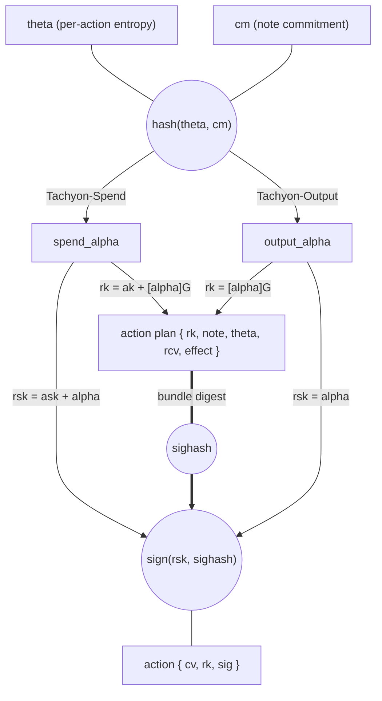
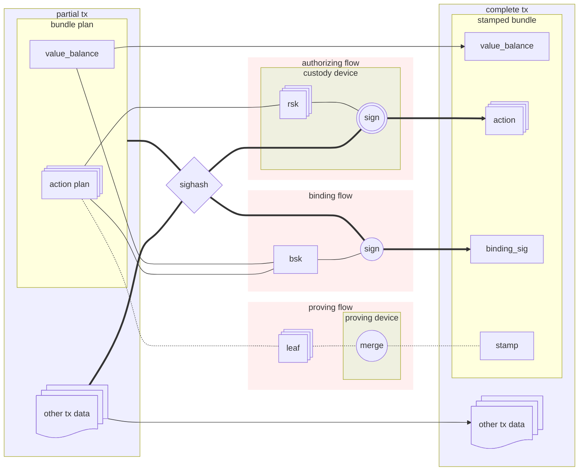

# Authorization

A Tachyon bundle requires three layers of authorization: per-action signatures that bind each tachyaction to its tachygram, value commitments that hide individual values while preserving their algebraic sum, and a binding signature that proves the declared balance is correct.
This chapter covers each layer, then shows the complete flow from action creation through consensus.

## Actions

Each tachyaction requires a fresh randomized key pair.

The planner begins authorization by selecting arbitrary `theta` and a relevant note for each action. The custody device is provided each note and `theta` so it may independently confirm planning work.

The arbitrary entropy `theta` which combines with note commitment `cm` to deterministically produce the randomizer `alpha`:

$$ \alpha_{\text{spend}} = \text{BLAKE2b-512}_\text{Tachyon-Spend}(\theta \| \mathsf{cm}) $$
$$ \alpha_{\text{output}} = \text{BLAKE2b-512}_\text{Tachyon-Output}(\theta \| \mathsf{cm}) $$

Actions are signed with a unique per-action `rsk` signing key.
Spends and outputs have different relationships between `alpha` and `rsk`, but in both cases,
the action's published `rk` validating key is the public counterpart of `rsk`.

$$ \mathsf{rk} = [\mathsf{rsk}]\,\mathcal{G} $$

### Spend

Derivation of spend `rsk` is rerandomization of spending authority `ask`:

$$ \mathsf{rsk} = \mathsf{ask} + \alpha $$
$$ \mathsf{rk} = [\mathsf{ask} + \alpha]\,\mathcal{G}$$

Conveniently, `rk` is also possible to derive from validating `ak`.
The rerandomization of a validating key is equivalent to derivation of a validating key from the rerandomized authority:

$$ \mathsf{rk} = \mathsf{ak} + [\alpha]\,\mathcal{G} $$

So during planning, the planning device obtains `rk` from the validating `ak`.
Then during authorization, the custody device is able to confirm correctness of `rk`, and sign the spend action with its private `rsk`.

### Output

An output `rsk` is simply equal to `alpha`. No authority needed:

$$ \mathsf{rsk} = \alpha $$
$$ \mathsf{rk} = [\alpha]\,\mathcal{G} $$

Then during authorization, the custody device is able to confirm correctness of `rk`, before signing any spends.

## Bundle commitment

The bundle commitment is a digest of the bundle's effect.

$$ d_i = \text{Poseidon}_\text{Tachyon-ActnDgst}(\mathsf{cv}_i \| \mathsf{rk}_i) $$
$$ \text{BLAKE2b-512}_\text{Tachyon-BndlHash}( d_1 \| d_2 \| \ldots \| d_n \| \mathsf{value\_balance}) $$

The bundle commitment hashes the individual action digests in order.
The same action digests are used as polynomial roots in the PCD stamp header's accumulator commitment, binding the stamp to the same set of actions as the signatures.

The stamp is excluded because it is stripped during [aggregation](./aggregation.md).

### Transaction sighash

All signatures (action and binding) sign the same transaction-wide sighash.
The sighash is computed at the transaction layer, incorporating the bundle commitment from each pool (transparent, sapling, orchard, tachyon).
The tachyon crate contributes its bundle commitment; a transaction-level crate computes the sighash and passes it in as opaque bytes.

This binds every signature to the complete set of effecting data across all pools.
Since `rk` is itself a commitment to `cm` (via `alpha`'s derivation from `theta` and `cm`), the signature transitively binds each action to its tachygram without the tachygram appearing in the action.

## Value Balance

Tachyon uses Pedersen commitments on the Pallas curve for value hiding:

$$\mathsf{cv} = [v]\,\mathcal{V} + [\mathsf{rcv}]\,\mathcal{R}$$

where $v$ is the signed integer value (positive for spends, negative for outputs) and `rcv` is a random[^rcv-note] trapdoor in $\mathbb{F}_q$.

[^rcv-note]: `rcv` is currently sampled as a uniformly random scalar (`Fq::random`). This derivation may be revised in the future to incorporate a hash of the note commitment or other action-specific data.

The generators $\mathcal{V}$ and $\mathcal{R}$ are shared with Orchard, derived from the domain `z.cash:Orchard-cv`.[^generator-todo]

[^generator-todo]: The binding signature scheme uses `reddsa::orchard::Binding` which hardcodes $\mathcal{R}$ as its basepoint. We should consider defining a unique personalization.

### Binding signature

The sum of value commitments preserves the algebraic structure:

$$\sum_i \mathsf{cv}_i = \bigl[\sum_i v_i\bigr]\,\mathcal{V} + \bigl[\sum_i \mathsf{rcv}_i\bigr]\,\mathcal{R}$$

This enables the binding signature scheme to prove value balance without revealing individual values.

The binding signature proves that the bundle's value commitments are consistent with the declared `value_balance`.

**Planner** knows every `rcv` and computes `bsk`:

$$\mathsf{bsk} = \sum_i \mathsf{rcv}_i$$

The planner signs the transaction sighash to produce `binding_sig` directly, without custody assistance.

**Validators** know the claimed `value_balance` and each published action `cv`. Validators reconstruct the corresponding public key:

$$\mathsf{bvk} = \sum_i \mathsf{cv}_i - [\mathsf{value\_balance}]\,\mathcal{V}$$

Expanding the commitments $\mathsf{cv}_i = [v_i]\,\mathcal{V} + [\mathsf{rcv}_i]\,\mathcal{R}$:

$$\mathsf{bvk} = \bigl[\sum_i v_i - \mathsf{value\_balance}\bigr]\,\mathcal{V} + \bigl[\sum_i \mathsf{rcv}_i\bigr]\,\mathcal{R}$$

When $\sum_i v_i = \mathsf{value\_balance}$, the $\mathcal{V}$ component vanishes:

$$\mathsf{bvk} = [\mathsf{bsk}]\,\mathcal{R}$$

If the values don't balance, the $\mathcal{V}$ term survives. So,

- If the sum of committed values doesn't truly equal the public balance, the signer cannot produce a valid signature.
- If a valid signature was produced and then the committed values or the public balance were modified, the validator can't confirm the valid signature.

## Simplified Flow

A bundle plan feeds three independent paths that converge in the final bundle.
Each path consumes the same action plans but produces a different component of the bundle:

- **Authorizing**: custody derives `rsk` per spend action and signs the transaction sighash; output actions are signed by the user device.
- **Binding**: the bundle commitment (from ordered action digests and `value_balance`) feeds into the transaction sighash, which the binding key signs.
- **Proving**: each action plan yields a leaf stamp; leaves merge into a single Ragu PCD stamp.

Consensus recomputes action digests from visible actions and checks them against both the sighash (via the bundle commitment) and the stamp (via the polynomial commitment in the PCD header).

A modified action breaks both checks.

## Detailed Sequence

```mermaid
sequenceDiagram

actor User

activate User

    note over User: select/create notes { pk, psi, rcm, v }

rect rgb(100, 149, 237, 0.1)
    loop per action

        note over User: random theta
        note over User: random rcv
        note over User: cm = Poseidon(pk, psi, rcm, v)
        alt spend
            note over User: alpha = Blake2b(theta || cm)
            note over User: rk = ak + [alpha]G
            note over User: cv = Pedersen(v, rcv)
        else output
            note over User: alpha = Blake2b(theta || cm)
            note over User: rk = [alpha]G
            note over User: cv = Pedersen(-v, rcv)
        end
        note over User: action_plan { rk, note, theta, rcv, effect }
    end

    note over User: bundle_plan { action_plan[], value_balance }


end

loop per output action
    note over User: sig = Sign(alpha, sighash)
end
note over User: bsk = Sum rcv_i
note over User: binding_sig = Sign(bsk, sighash)


par Authorizing
    rect rgb(255, 165, 0, 0.1)

        create participant Custody@{ type: "boundary" }

        User ->> Custody: bundle_plan, binding_sig, output_sigs, tx etc

        loop per action
            alt spend
                note over Custody: cv = Pedersen(v, rcv)
            else output
                note over Custody: cv = Pedersen(-v, rcv)
            end
            note over Custody: action_digest_i = Poseidon(cv || rk)
        end
        note over Custody: bundle_commitment = Blake2b(d_1 || ... || d_n || value_balance)
        note over Custody: compute sighash

        break
            note over Custody: validate output_sigs
            note over Custody: validate binding_sig
        end

        loop per spend action
            note over Custody: alpha = Blake2b(theta || cm)
            note over Custody: rsk = ask + alpha
            note over Custody: sig = Sign(rsk, sighash)
        end
        destroy Custody
        Custody -->> User: action_sigs, tx sigs
        note over User: apply signatures
    end

and Proving 
    rect rgb(138, 43, 226, 0.1)
        note over User: select anchor

        loop per action
        critical anchor, action plan { rk, note, theta, rcv, effect }, pak { ak, nk }
                alt effect == spend
                    User --> User: rk == ak + [alpha]G
                    note over User: flavor = epoch(anchor)
                    note over User: nf = Poseidon(nk, psi, flavor)
                    note over User: tg_root = Poseidon(nf)
                else effect == output
                    User --> User: rk == [alpha]G
                    note over User: cm = Poseidon(pk, psi, rcm, v)
                    note over User: tg_root = Poseidon(cm)
                end
                note over User: action_root = Poseidon(cv || rk)
                note over User: action_poly = (X - action_root), tg_poly = (X - tg_root)
                note over User: pcd: leaf stamp(Commit(action_poly), Commit(tg_poly), anchor)
            end
        end

        create participant Stamper
        User ->> Stamper: leaf stamps, tachygrams


        loop while stamps > 1
            critical left(action_poly, tg_poly, anchor), right(action_poly, tg_poly, anchor)
                note over Stamper: merged_action = left.action_poly * right.action_poly
                note over Stamper: merged_tg = left.tg_poly * right.tg_poly
                note over Stamper: anchor = max(left.anchor, right.anchor)
                note over Stamper: pcd: stamp(Commit(merged_action), Commit(merged_tg), anchor)
            end
        end
        destroy Stamper
        Stamper ->> User: stamp(tachygrams, anchor, proof)

        break
            note over User: reconstruct polynomials from roots, commit, verify
        end
    end
end



create participant Consensus
note over User: transaction { actions[], value_balance, binding_sig, stamp } 
deactivate User
destroy User
User ->> Consensus: transaction
break
    note over Consensus: action_digest_i = Poseidon(cv_i || rk_i)
    note over Consensus: bundle_commitment = Blake2b(d_1 || ... || d_n || value_balance)
    note over Consensus: compute sighash
    note over Consensus: check action sigs against sighash
    note over Consensus: check binding sig against sighash
    note over Consensus: action_acc = Commit(poly from action roots)
    note over Consensus: tachygram_acc = Commit(poly from tachygram roots)
    note over Consensus: verify stamp(action_acc, tachygram_acc, anchor)
end
```

