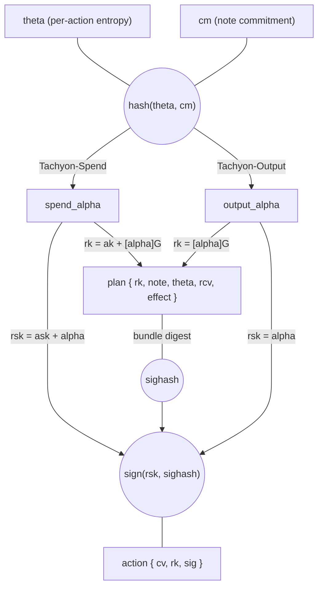
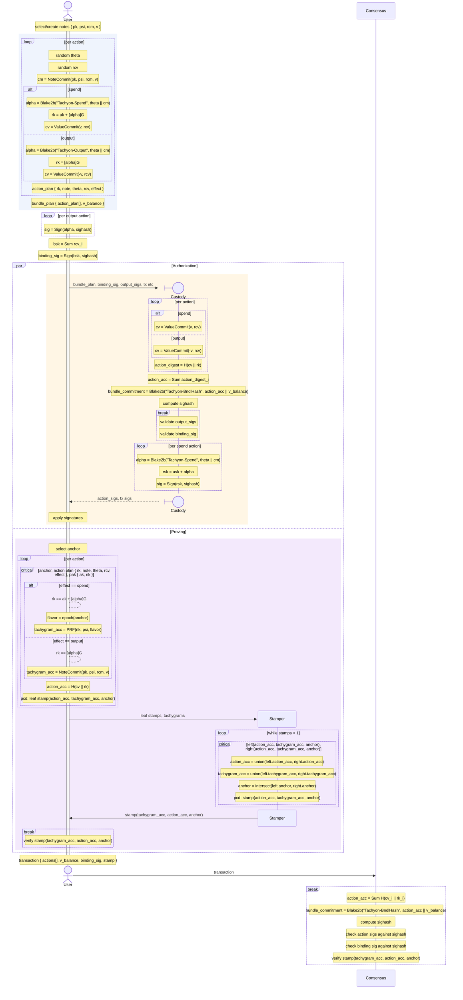

# Authorization

A Tachyon bundle requires three layers of authorization: per-action signatures that bind each tachyaction to its tachygram, value commitments that hide individual values while preserving their algebraic sum, and a binding signature that proves the declared balance is correct.
This chapter covers each layer, then shows the complete flow from action creation through consensus.

## Per-action Signing

Each tachyaction requires a fresh randomized key pair.
The authorization flow starts with per-action entropy $\theta$ and diverges based on whether the action is a spend or output.

### ActionEntropy ($\theta$)

32 bytes of randomness chosen by the signer.
Combined with a note commitment to deterministically derive the randomizer $\alpha$:

$$\alpha_{\text{spend}} = \text{ToScalar}(\text{BLAKE2b-512}(\text{"Tachyon-Spend"},\; \theta \| \mathsf{cm}))$$

$$\alpha_{\text{output}} = \text{ToScalar}(\text{BLAKE2b-512}(\text{"Tachyon-Output"},\; \theta \| \mathsf{cm}))$$

Distinct personalizations prevent the same $(\theta, \mathsf{cm})$ pair from producing identical $\alpha$ values for spend and output actions.

This design enables **hardware wallet signing without proof construction**: the hardware wallet holds $\mathsf{ask}$ and $\theta$, signs with $\mathsf{rsk} = \mathsf{ask} + \alpha$, and a separate device constructs the proof later using $\theta$ and $\mathsf{cm}$ to recover $\alpha$.

### Spend vs Output

Both paths produce $\mathsf{rk}$ during the assembly phase, then sign the transaction sighash during the authorization phase.
The randomizer $\alpha$ is retained separately as a proof witness.

**Spend** — requires spending authority:

$$\mathsf{rsk} = \mathsf{ask} + \alpha$$

The resulting $\mathsf{rk} = \mathsf{ak} + [\alpha]\,\mathcal{G}$ is a re-randomization of the spend validating key.
During assembly, the user device derives $\mathsf{rk}$ from the public key $\mathsf{ak}$ (no $\mathsf{ask}$ needed).
During authorization, the custody device derives $\alpha$, computes $\mathsf{rsk}$, and signs the transaction sighash.

**Output** — no spending authority needed:

$$\mathsf{rsk} = \alpha$$

The resulting $\mathsf{rk} = [\alpha]\,\mathcal{G}$ is a re-randomization of the generator itself.
No custody device is involved.

Both produce an $\mathsf{rk}$ that can verify a signature, but only the spend's $\mathsf{rk}$ requires knowledge of $\mathsf{ask}$.
This unification lets consensus treat all tachyactions identically.

### Bundle commitment

The bundle commitment is a digest of the bundle's effect:

$$\mathsf{actions\_acc} = \sum_i H(\mathsf{cv}_i \| \mathsf{rk}_i)$$

The accumulator is order-independent (addition is commutative), so the bundle commitment does not depend on action ordering.

$$\mathsf{bundle\_commitment} = \text{BLAKE2b-512}(\text{"Tachyon-BndlHash"},\; \mathsf{action\_acc} \| \mathsf{v\_balance})$$

The stamp is excluded because it is stripped during [aggregation](./aggregation.md).
The same $\mathsf{action\_acc}$ appears in the Ragu PCD stamp header, binding the stamp to the same set of actions as the signatures.

### Transaction sighash

All signatures (action and binding) sign the same transaction-wide sighash.
The sighash is computed at the transaction layer, incorporating the bundle commitment from each pool (transparent, sapling, orchard, tachyon).
The tachyon crate contributes its bundle commitment; a transaction-level crate computes the sighash and passes it in as opaque bytes.

This binds every signature to the complete set of effecting data across all pools.
Since $\mathsf{rk}$ is itself a commitment to $\mathsf{cm}$ (via $\alpha$'s derivation from $\theta$ and $\mathsf{cm}$), the signature transitively binds each action to its tachygram without the tachygram appearing in the action.

| Key            | Lifetime   | Can sign? | Can verify? |
| -------------- | ---------- | --------- | ----------- |
| $\mathsf{ask}$ | Long-lived | No        | —           |
| $\mathsf{ak}$  | Long-lived | —         | No          |
| $\mathsf{rsk}$ | Per-action | **Yes**   | —           |
| $\mathsf{rk}$  | Per-action | —         | **Yes**     |

## Value Balance

Tachyon uses Pedersen commitments on the Pallas curve for value hiding:

$$\mathsf{cv} = [v]\,\mathcal{V} + [\mathsf{rcv}]\,\mathcal{R}$$

where $v$ is the signed integer value (positive for spends, negative for outputs) and $\mathsf{rcv}$ is a random trapdoor in $\mathbb{F}_q$.

$\mathsf{rcv}$ is currently sampled as a uniformly random scalar (`Fq::random`). This derivation may be revised in the future to incorporate a hash of the note commitment or other action-specific data.

The generators $\mathcal{V}$ and $\mathcal{R}$ are shared with Orchard, derived from the domain `z.cash:Orchard-cv`.
This reuse is intentional — the binding signature scheme uses `reddsa::orchard::Binding` which hardcodes $\mathcal{R}$ as its basepoint.

### Homomorphic property

The sum of value commitments preserves the algebraic structure:

$$\sum_i \mathsf{cv}_i = \bigl[\sum_i v_i\bigr]\,\mathcal{V} + \bigl[\sum_i \mathsf{rcv}_i\bigr]\,\mathcal{R}$$

This enables the binding signature scheme to prove value balance without revealing individual values.

### Binding signature

The binding signature proves that the bundle's value commitments are consistent with the declared $\mathsf{v\_balance}$.

**Signer** — knows every $\mathsf{rcv}_i$ and computes:

$$\mathsf{bsk} = \sum_i \mathsf{rcv}_i$$

The signer signs the transaction sighash with $\mathsf{bsk}$.

**Validator** — knows each $\mathsf{cv}_i$ (from actions) and $\mathsf{v\_balance}$ (from the bundle), and reconstructs the corresponding public key:

$$\mathsf{bvk} = \sum_i \mathsf{cv}_i - [\mathsf{v\_balance}]\,\mathcal{V}$$

Expanding the commitments $\mathsf{cv}_i = [v_i]\,\mathcal{V} + [\mathsf{rcv}_i]\,\mathcal{R}$:

$$\mathsf{bvk} = \bigl[\sum_i v_i - \mathsf{v\_balance}\bigr]\,\mathcal{V} + \bigl[\sum_i \mathsf{rcv}_i\bigr]\,\mathcal{R}$$

When $\sum_i v_i = \mathsf{v\_balance}$, the $\mathcal{V}$ component vanishes:

$$\mathsf{bvk} = [\mathsf{bsk}]\,\mathcal{R}$$

So $\mathsf{bsk}$ is the discrete log of $\mathsf{bvk}$ with respect to $\mathcal{R}$ — exactly what the signature proves.
If the values don't balance, the $\mathcal{V}$ term survives and the signer cannot produce a valid signature (by the binding property of the Pedersen commitment).

## End-to-end Flow

A bundle plan feeds three independent paths that converge in the final bundle.
Each path consumes the same action plans but produces a different component of the bundle:

- **Proving** — each action plan yields a leaf stamp; leaves merge into a single Ragu PCD stamp.
- **Signing** — custody derives $\mathsf{rsk}$ per spend action and signs the transaction sighash; output actions are signed by the user device.
- **Binding** — the bundle commitment (from $\mathsf{action\_acc}$ and $\mathsf{v\_balance}$) feeds into the transaction sighash, which the binding key signs.

Consensus recomputes $\mathsf{action\_acc}$ from the visible actions and checks it against both the sighash (via the bundle commitment) and the stamp (via the PCD header).
A modified action breaks both checks.

Transaction construction is split into three phases: **assembly** (create action plans with $\mathsf{rk}$ and $\mathsf{rcv}$; $\mathsf{cv}$ is derived on demand), **commitment** (derive $\mathsf{cv}$ from each plan and compute the bundle commitment), and **authorization** (custody independently derives $\mathsf{cv}$, computes the sighash, and signs spend actions).
Signing and stamping run in parallel — stamping depends only on the action plans and anchor, not on signatures or the sighash.

A single user device may act as custody and stamper, but the trust boundary is only required to cover custody and the user device.

