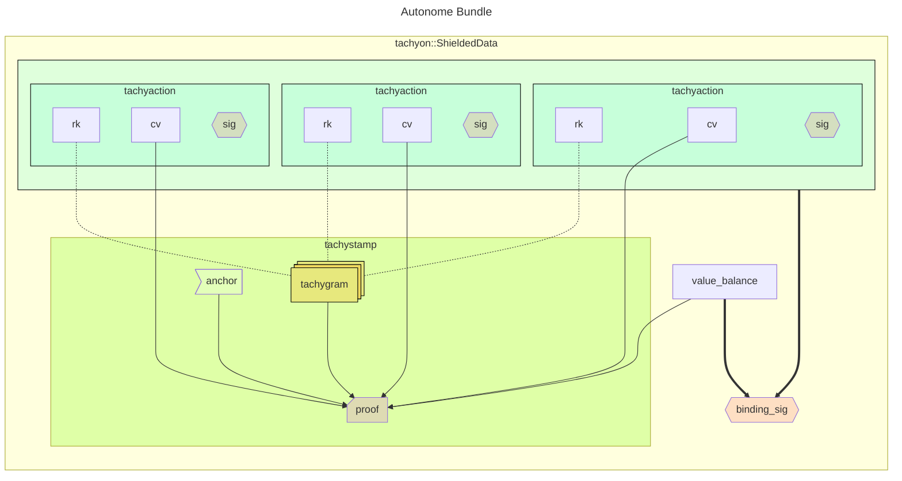

# Bundles

This document describes the structure of Tachyon shielded bundles.

## Brief

Users create transactions with a bundle of Tachyon shielded data including a Ragu[^ragu] proof.
These transactions are broadcast to the p2p network.

Before block inclusion, Tachyon shielded data is recursively 'aggregated' in a compact format that ultimately reduces the operational burdens and improves the user experience of the chain.

## Concepts

### Tachygrams

**Tachygrams** are 32-byte field elements representing either nullifiers or note commitments. The consensus protocol does not need to distinguish between nullifiers and note commitments, and treats them identically.[^tachygram]

[^tachygram]: See [Tachyaction at a Distance](https://seanbowe.com/blog/tachyaction-at-a-distance/) for the design rationale behind unified tachyactions and tachygrams.
[^ragu]: See the Ragu [book](https://tachyon.z.cash/ragu/).
[^redpallas]: See [RedDSA](https://zips.z.cash/protocol/protocol.pdf#concretereddsa) in the Zcash Protocol Specification.

### Tachyactions

Each **tachyaction** indistinguishably represents either the creation or destruction of a note.

- A tachyaction with a commitment tachygram proves a note is created.
- A tachyaction with a nullifier tachygram proves a note is destroyed.

**Each tachyaction is cryptographically bound to one tachygram, but does not contain that tachygram.* A tachyaction *does* contain:

- `cv` - a 32-byte homomorphic commitment to the note's created or destroyed value
- `rk` - a 32-byte public key[^ragu-rerandomization] bound to one tachygram
- `sig` - a 64-byte RedPallas[^redpallas] signature by `rk` over the transaction sighash

[^ragu-rerandomization]: Ragu's [proof rerandomization](https://tachyon.z.cash/ragu/implementation/proofs.html#rerandomization) conceals private proof inputs by selecting new unrelated proof inputs that verify identically.

### Tachystamp

The **tachystamp** is a recursive zero-knowledge proof that all related tachyactions follow the correct rules.

It contains:

- `anchor` - a chain [anchor](./anchor.md)
- `proof` - the recursive proof (which may be aggregated)
- `tachygrams` - nullifiers and commitments for each action

The proof establishes:

- tachygrams either create a new note or destroy an existing note
- tachygrams are correctly bound to action keys
- action balance effect matches pool balance effect

The nullifier for epoch $e$ is a pseudo-random function of the note's master key and the epoch:

$$ \mathsf{nf}_e = \mathsf{PRF}^{\mathsf{nfTachyon}}_{\mathsf{mk}}(e) $$

where

- $\mathsf{mk} = \mathsf{Poseidon}_\texttt{Tachyon-NfMaster}\!(\psi, \mathsf{nk})$ is the note's master key, seeded by the trapdoor $\psi$ committed in the $\psi$ field[^commitment]
- $\mathsf{PRF}^{\mathsf{nfTachyon}}$ is the [nullifier PRF](./nullifiers.md)
- $e$ is an epoch index

[^commitment]: User-controlled randomness [commitment trapdoor](https://zips.z.cash/protocol/protocol.pdf#commitment)

## Bundle Structure

A Tachyon bundle collects tachyactions with authorization data:

- `tachyactions` - the tachyactions
- `value_balance` - integer net pool effect
- `binding_sig` - signature over the transaction sighash (same digest as action sigs)
- `tachystamp` - anchor, proof, tachygrams (may be aggregated)

## Lifecycle

Users create transactions containing their individual actions and individual stamp, known as **autonomes**. These are broadcast to the p2p network. Before block inclusion, aggregators strip and merge stamps from selected transactions, producing **aggregates** (transactions carrying merged stamps) and **adjuncts** (transactions stripped of their stamp).

See [Aggregation](./aggregation.md) for transaction categories, block layout, and validation.

## Wire Format

The first byte `tachyonBundleState` selects one of three bundle states:

| value | state | bundle contents |
| --- | --- | --- |
| `0b0000_0000` | non-tachyon | no bundle |
| `0b0000_0001` | stamped | bundle with `hStampActionsTachyon`, anchor, tachygrams, proof |
| `0b0000_0010` | stripped | bundle with the covering aggregate's `wtxid` |

### Bundle body

When `tachyonBundleState` is not `0x00`, the state byte is followed by the bundle body, which is the same in both remaining states:

| Name | Format | Description |
| --- | --- | --- |
| `valueBalanceTachyon` | i64 | net value of tachyon actions |
| `nActionsTachyon` | compactsize | number of tachyon actions |
| `vActionsTachyon` | 64 * nActionsTachyon | `cv` (32 bytes), `rk` (32 bytes) |
| `vActionSigsTachyon` | 64 * nActionsTachyon | authorization per action over the tx sighash |
| `bindingSigTachyon` | 64 bytes | binding signature over the tx sighash |
| `nMemoTachyon` | compactsize | memo length, `0` when absent |
| `vMemoTachyon` | nMemoTachyon bytes | opaque recipient-directed payload |

The memo is effecting data, so the transaction sighash covers it and `auth_digest` does not. A relayer rewrites `auth_digest` while aggregating, so a memo held there could be stripped while the block still committed to the same transaction.

`nMemoTachyon` is public, and `0` reveals that no payload is present. The field is variable-length because Tachyon has no per-action ciphertext to hide a memo inside: an action is `(cv, rk)`, 64 bytes. The payload is also bimodal, carrying key-exchange ciphertexts on first contact and ordinary memo text otherwise, at sizes differing by more than an order of magnitude. A fixed field would have to be sized for the first-contact case and charged on every transaction.

### Stamp trailer

When `tachyonBundleState == 0x01`, the bundle body is followed by a stamp trailer:

| Name | Format | Description |
| --- | --- | --- |
| `hStampActionsTachyon` | 32 bytes | BLAKE2b-256 digest of the covered action descriptors |
| `anchorTachyon` | 32 bytes | pool state reference |
| `cTachygrams` | 32 bytes | commitment to the tachygrams below |
| `nTachygrams` | compactsize | number of tachygrams |
| `vTachygrams` | 32 * nTachygrams | tachygrams for this proof |
| `proofTachyon` | PROOF_SIZE blob | serialized proof of fixed size |

`cTachygrams` is carried rather than derived, so full validation recomputes it from `vTachygrams` and rejects a mismatch. Anchor advancement then absorbs the carried point instead of rebuilding it, which is what lets a validator extend the chain without touching the tachygrams again.

Every action contributes exactly two tachygrams, so a well-formed stamp has

$$
\mathtt{nTachygrams} = 2 \cdot \mathtt{nActionsTachyon}
$$

for its own actions, and the sum over covered actions once stamps are merged. A spend publishes its present and next nullifier; an output publishes its note commitment and a padding tachygram. Uniform arity is what keeps the two action kinds indistinguishable in the published set.

`hStampActionsTachyon` is an assistive indicator: a BLAKE2b-256 digest, under the `Tachyon-Actions` personalization, over the sorted `cv || rk` descriptors of every action the stamp covers. It is authorization data that lets observers cheaply identify and correlate transactions without verifying the proof. The proof binds the same actions by a different construction, a Pedersen commitment to their Poseidon digests, so the trailer field is a second digest of one action set rather than a copy of the proof's. See [Aggregation → Action set indicator](./aggregation.md#action-set-indicator).

### Stripped trailer

When `tachyonBundleState == 0x02`, the bundle body is followed by a stripped trailer:

| Name | Format | Description |
| --- | --- | --- |
| `tachyonAggregateId` | 64 bytes | nonzero `wtxid` of the covering aggregate |

Every stripped bundle names a covering aggregate, so `tachyonAggregateId` is always nonzero. This holds even for a stripped innocent (an aggregate with no Tachyon actions of its own): the all-zero `wtxid`, which refers to no aggregate, is rejected on read.

The stripped trailer carries no `hStampActionsTachyon`: that field rides on the stamp, so it strips away when a bundle becomes an adjunct. Observers read the covering aggregate's `hStampActionsTachyon` from the stamped aggregate, not from the adjunct.
