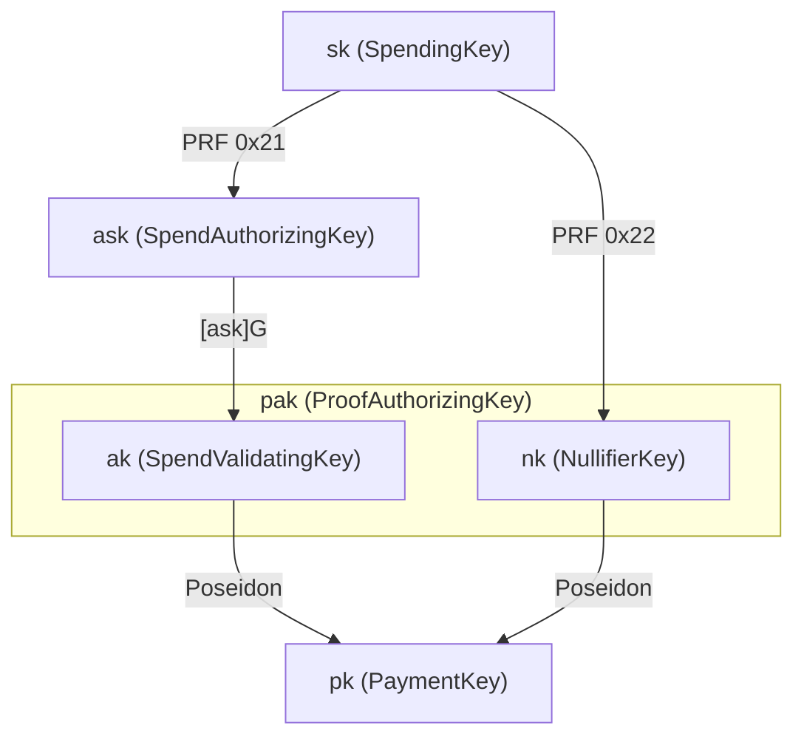

# Key Hierarchy

<!-- todo: this is significantly outdated -->

Tachyon simplifies the Zcash key hierarchy by removing key diversification, viewing keys, and payment addresses from the core protocol. These capabilities are handled by higher-level wallet software through out-of-band payment protocols.[^out-of-band]

[^out-of-band]: See [Tachyaction at a Distance](https://seanbowe.com/blog/tachyaction-at-a-distance/) for the full design rationale behind out-of-band payments and the simplified key hierarchy.

## Derivation

The spending key $\mathsf{sk}$ derives $\mathsf{ask}$ and $\mathsf{nk}$ via domain-separated PRF expansion:

$$ \text{PRF}^{\text{expand}}_{\mathsf{sk}}(t) = \text{BLAKE2b-512}(\text{"Zcash\_ExpandSeed"},\; \mathsf{sk} \| t) $$

The payment key $\mathsf{pk}$ is then derived from both $\mathsf{ak}$ and $\mathsf{nk}$ via Poseidon, binding it to the full proof authorizing key.

### Comparison with Orchard

| Layer | Orchard | Tachyon | Rationale |
| ----- | ------- | ------- | --------- |
| Root | Spending key ($\mathsf{sk}$) | Spending key ($\mathsf{sk}$) | Identical |
| Auth | $\mathsf{ask} \to \mathsf{ak}$ | $\mathsf{ask} \to \mathsf{ak}$ | Identical (RedPallas) |
| Viewing | Full viewing key ($\mathsf{ak}, \mathsf{nk}, \mathsf{rivk}$) | **Removed** | Out-of-band |
| Incoming | $\mathsf{dk}, \mathsf{ivk}, \mathsf{ovk}$ | **Removed** | Out-of-band |
| Address | Diversifier $d$, transmission key $\mathsf{pk_d}$ | $\mathsf{pk} = \text{Poseidon}(\mathsf{ak}_x, \mathsf{nk})$ | No diversification; binds to pak |
| Proof authorization | Not separated | $\mathsf{pak} = (\mathsf{ak}, \mathsf{nk})$ | Authorize proofs for all notes |
| Per-note delegation | Not separated | $(\mathsf{ak}, \mathsf{mk})$ | Delegate proofs for one note |

The key insight is that removing in-band secret distribution (on-chain ciphertexts) eliminates the need for viewing keys, diversified addresses, and the entire key tree that supports them.

## Long-lived Keys

### Spending key ($\mathsf{sk}$)

Raw 32-byte entropy. The root of all authority — must be kept secret. Matches Orchard's representation (raw bytes, not a field element), preserving the full 256-bit key space.

### Spend authorizing key ($\mathsf{ask}$)

$$\mathsf{ask} = \text{ToScalar}\bigl(\text{PRF}^{\text{expand}}_{\mathsf{sk}}([\texttt{0x21}])\bigr)$$

A long-lived $\mathbb{F}_q$ scalar derived from $\mathsf{sk}$. **Cannot sign directly** — it must be randomized into a per-action $\mathsf{rsk}$ first. Per-action randomization ensures each $\mathsf{rk}$ is unlinkable to $\mathsf{ak}$, so observers cannot correlate actions to the same spending authority.

#### Sign normalization

RedPallas requires the public key $\mathsf{ak} = [\mathsf{ask}]\,\mathcal{G}$ to have $\tilde{y} = 0$ (sign bit cleared). Pallas point compression encodes $\tilde{y}$ in bit 255 of the 32-byte representation. If $\tilde{y}(\mathsf{ak}) = 1$, we negate $\mathsf{ask}$:

$$[-\mathsf{ask}]\,\mathcal{G} = -[\mathsf{ask}]\,\mathcal{G}$$

This flips the y-coordinate sign, producing a valid $\mathsf{ak}$ with $\tilde{y} = 0$. The normalization happens once at derivation time.

### Spend validating key ($\mathsf{ak}$)

$$\mathsf{ak} = [\mathsf{ask}]\,\mathcal{G}$$

The long-lived counterpart of $\mathsf{ask}$. Corresponds to the "spend validating key" in Orchard (§4.2.3). Constrains per-action $\mathsf{rk}$ in the proof, tying accumulator activity to the holder of $\mathsf{ask}$.

$\mathsf{ak}$ **cannot verify action signatures directly** — it must be randomized into a per-action $\mathsf{rk}$ for verification. Component of the proof authorizing key $\mathsf{pak}$.

#### Three-tier naming

The spend authorization keys follow a three-tier scheme mapping to **private scalar → circuit witness → public on-chain**:

| Tier | Rust type | Protocol | Role |
| ---- | --------- | -------- | ---- |
| Spend-authorizing | `SpendAuthorizingKey` | $\mathsf{ask}$ | Private scalar, enables spend authorization |
| Spend-validating | `SpendValidatingKey` | $\mathsf{ak}$ | Circuit witness, constrains `rk` for accumulator binding |
| Action-verification | `ActionVerificationKey` | $\mathsf{rk}$ | Per-action, verifies signatures (on-chain) |

### Nullifier key ($\mathsf{nk}$)

$$\mathsf{nk} = \text{ToBase}\bigl(\text{PRF}^{\text{expand}}_{\mathsf{sk}}([\texttt{0x22}])\bigr)$$

An $\mathbb{F}_p$ element used in nullifier derivation.[^nullifiers] With the note's trapdoor $\psi$ it derives the master key $\mathsf{mk}$, which keys every epoch's nullifier derivation.

[^nullifiers]: See [Nullifiers](./nullifiers.md) for the full derivation.

### Payment key ($\mathsf{pk}$)

$$\mathsf{pk} = \text{Poseidon}(\text{PK\_DOMAIN}, \mathsf{ak}_x, \mathsf{nk})$$

where $\mathsf{ak}_x$ is the x-coordinate of the spend validating key. Replaces Orchard's diversified transmission key $\mathsf{pk_d}$ and the entire diversified address system:

> "Tachyon removes the diversifier $d$ because payment addresses are removed. The transmission key $\mathsf{pk_d}$ is substituted with a payment key $\mathsf{pk}$."
> — "Tachyaction at a Distance" (Bowe 2025)

Deriving $\mathsf{pk}$ from $(\mathsf{ak}, \mathsf{nk})$ binds the payment key to the full proof authorizing key. Since $\mathsf{pk}$ is committed in the note commitment $\mathsf{cm}$, the accumulator membership check transitively pins both $\mathsf{ak}$ and $\mathsf{nk}$. A wrong $\mathsf{nk}$ produces a wrong $\mathsf{pk}$, a wrong $\mathsf{cm}$, and accumulator inclusion fails.

$\mathsf{pk}$ is deterministic in $(\mathsf{ak}, \mathsf{nk})$, so unlinkability comes from **minting a fresh address per sender**: a receiver walks its wallet-standard derivation path to a freshly indexed $(\mathsf{ak}, \mathsf{nk})$ pair and hands the sender the $\mathsf{pk}$ that follows. The index sits above $\mathsf{sk}$ rather than between $\mathsf{sk}$ and $(\mathsf{ak}, \mathsf{nk})$, so the concrete path is a wallet-standard concern; the protocol requires only that the resulting keys be indistinguishable from randomly sampled ones. Transfer proofs never constrain the derivation. Address distribution is handled out of band (ZIP 321 payment requests, ZIP 324 URI encapsulated payments).

Freshness is receiver-minted by necessity, not by choice of API. A sender-chosen tweak would need $\mathsf{pk}$ to admit one, and $\mathsf{pk}$ is a hash-based commitment deliberately: the diversified-base trick behind Orchard's $\mathsf{pk_d}$ has no known secure analogue under lattice assumptions, and publishing $\mathsf{ak}$ to senders would expose harvest-now-decrypt-later risk. A hash admits no tweak.

### Proof authorizing key ($\mathsf{pak}$)

$$\mathsf{pak} = (\mathsf{ak}, \mathsf{nk})$$

Allows constructing proofs without spend authority. The prover uses $\mathsf{ak}$ to constrain $\mathsf{rk} = \mathsf{ak} + [\alpha]\mathcal{G}$ and $\mathsf{nk}$ to constrain nullifier correctness in the circuit.

$\mathsf{pak}$ covers **all notes** because $\mathsf{nk}$ is wallet-wide. For narrower delegation, per-note key bundles restrict scope:

| Bundle | Keys | Holder | Scope |
| ------ | ---- | ------ | ----- |
| $\mathsf{pak}$ | $(\mathsf{ak}, \mathsf{nk})$ | Prover | All notes, all epochs |
| per-note | $(\mathsf{ak}, \mathsf{mk})$ | Per-note prover | One note, all epochs |
