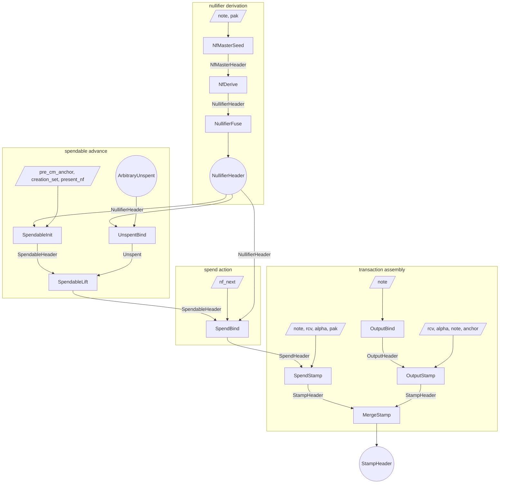
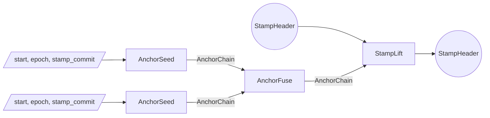
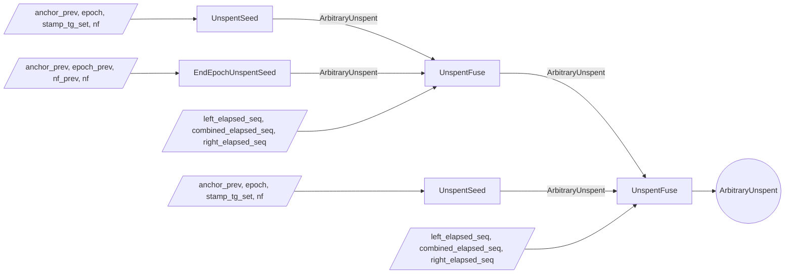

# Proof tree

The Tachyon proof tree is a graph of proof steps.
Each step accepts arbitrary witness inputs and up to two PCD inputs, performs computations and checks constraints, and emits a new PCD.

Multiple parties execute the proof tree.

- A **wallet** holds note data and keys
- A **sync service** holds nullifier values shared by the wallet and pool state proofs
- An **aggregator** merges stamps for pool efficiency

## Lifecycle

### Deriving nullifiers

A wallet proves a contiguous run of its note's nullifiers were correctly derived[^nullifiers].
`NfMasterSeed` witnesses the note and the proof-authorizing key `pak`, checks `note.pk == pak.derive_payment_key()` (which pins `nk`, and through `nk` the commitment `cm`), derives the master key `mk` and `cm`, and emits an `NfMasterHeader` carrying `(cm, mk)`.
`NfDerive` runs one sponge over `(mk, group)` to derive the group's nullifiers, and witnesses a boolean mask selecting a contiguous run of them: the emitted `NullifierHeader` carries `cm`, the boundary `(epoch, nf)` pairs of the run, and an `nf_seq_commit` over the run's half-open epoch range, with `epoch_start` shifted past the leading unselected epochs.
`NullifierFuse` concatenates two adjacent nullifier sequences into one, requiring the same `cm` and contiguity (`right.epoch_start == left.epoch_end`).
The result is a `NullifierHeader` proving the range `[epoch_start, epoch_end)` commits to the genuine derived nullifiers `PRF(mk, ·)` of the note identified by `cm`, surfacing `nf_start` and `nf_end` as its boundary members.

### Bootstrapping a spendable

A spendable starts when `SpendableInit` consumes the wallet's single-epoch `NullifierHeader` for the starting epoch.
It witnesses `(pre_cm_anchor, creation_set, present_nf)`: it binds `present_nf` to the proven member by equality (`present_nf == nf_start`, the range spanning the single epoch `[epoch_start, epoch_start + 1)`), takes `cm` from the range header, checks `cm` is among the creation stamp's tachygrams[^tachygrams], and emits a `SpendableHeader` carrying `(cm, (epoch, present_nf), anchor)` with `anchor = pre_cm_anchor.next_stamp(epoch, creation_commit)`, the position immediately after the creation stamp, advanced by each lift.
`pre_cm_anchor` is a free witness, so the anchor binds only downstream: lift adjacency threads it to the eventual spend anchor, which consensus checks for chain membership, and a chain node's preimage fixes the real predecessor, the real creation epoch (pinning the starting derivation epoch), and the real cm-stamp.

### Maintaining a spendable

Maintaining the spendable means advancing its anchor forward over `ArbitraryUnspent` segments while proving the crossed nullifiers absent.
The sync service produces `ArbitraryUnspent` segments without ever holding the note, its `cm`, or `psi`.
The values a segment tests are arbitrary field elements as far as its own proof is concerned, which is why the segment can be built by a party that knows nothing about the note; only `UnspentBind` attributes them to a derivation.
`UnspentSeed` absorbs one stamp at a given absolute epoch and proves a wallet-supplied nullifier was absent from that stamp's tachygram set; the resulting `ArbitraryUnspent` has crossed no epoch boundary, so its `elapsed` is empty and `epoch_start == epoch_end` with `nf_start == nf_end` the tested nullifier.
A block that publishes no stamp advances no anchor, so a stampless span needs no segment and no proof work.
`UnspentFuse` composes two contiguous ranges that share a junction epoch (`right.epoch_start == left.epoch_end`): it concatenates their `elapsed` histories and seam-binds the junction nullifier (`left.nf_end == right.nf_start`) at adjacent anchors.
`EndEpochUnspentSeed` is the segment for the boundary itself: it folds the epoch tick from a witnessed epoch-terminal anchor and records the epoch it leaves as the one member of its `elapsed`, so `epoch_end == epoch_start + 1`.
A boundary is therefore a link like any other, and `UnspentFuse` composes it with its neighbours on both sides; an epoch that published nothing is simply two crossings with no stamp segment between them.
An `ArbitraryUnspent` records its span as two absolute epoch endpoints, `epoch_start` and `epoch_end`; the crossing count is their difference.

`UnspentBind` binds a sync-built `ArbitraryUnspent` to genuine derivation. It is wallet-side: it consumes the `ArbitraryUnspent` and a wallet `NullifierHeader` range, and proves the range commits to exactly the `elapsed` crossings followed by the tip `nf_end`, with the range's epochs equal to the `ArbitraryUnspent`'s span. So every crossed nullifier and the tip are proven `PRF(mk, ·)` outputs.
It emits an `Unspent` carrying the span's boundary nullifiers, anchors and epochs, and the note's `cm`.

`SpendableLift` is wallet-side and witness-free: it consumes a `SpendableHeader` and an `Unspent`.
It checks the verified segment's `cm` equals the spendable's (so the absence-proven nullifiers are this note's, and the value cannot drift), the segment's `nf_start` equals the spendable's `present_nf` (continuity), and the segment's `anchor_prev` equals the spendable's anchor (adjacency).
It advances to the segment's `nf_end` and `anchor_last`, threading `cm` unchanged.
A single lift can consume an arbitrarily long composed `ArbitraryUnspent`, including one that crosses many epoch boundaries.
A lineage resting on its epoch's terminal anchor lifts the same way: the boundary tick is a link, so a segment can open on it.

### Spending

To spend, the wallet runs `SpendBind`.
It consumes the `SpendableHeader` and a length-2 `NullifierHeader` range (the live pair for the current and next epochs), and witnesses the next-epoch nullifier `nf_next`.
It requires `range.epoch_end == range.epoch_start + 2` and `range.cm == spendable.cm`, then binds the published pair to the range's boundary leaves by equality: `present_nf == range.nf_start` and `nf_next == range.nf_end`.
Because `present_nf` is threaded from the lineage, the `nf_start` equality forces the range to start at the lineage's current epoch, while `nf_next` is pinned to the genuine end member $N_{e+1}$.
Nonzero guards close the `nf == 0` degenerate.
The output `SpendHeader` carries `cm`, the confirmed pair `(present_nf, nf_next)`, and the threaded anchor; it carries no curve points.

`SpendStamp` consumes that `SpendHeader` and witnesses the note and the action fields.
It requires `note.commitment() == cm`, so the witnessed note is the spendable lineage's note: the value commitment `cv` then commits to the minted value[^notes].
It derives the action digest from `cv` and the randomized action key `rk`, and emits a `StampHeader` whose tachygram set contains both nullifiers and whose anchor is threaded from the spend.

An output operation splits the same way, into `OutputBind` and `OutputStamp`.
`OutputBind` witnesses the new note and derives its tachygram pair, the note commitment `cm` and the padding tachygram `pad`, both from the same note fields[^tachygrams]; the resulting `OutputHeader` carries the pair and nothing else.
`OutputStamp` re-witnesses the note against `cm`, adds value-randomness, action-randomness, and an anchor, and emits a single-action `StampHeader` whose tachygram set is the pair. The wallet typically anchors each output at the same height as the transaction's spends so the merge can proceed without an intervening lift.

A transaction with multiple spend and output stamps composes them with `MergeStamp`.
The output is a single `StampHeader` whose multisets are the union of the two inputs' at the shared anchor.

After the transaction stamp is fully composed, the wallet may run `StampLift` over an `AnchorChain` segment to advance the stamp's anchor toward the present tip before publication.

On publication the bundle carries the action descriptors, tachygrams, anchor, and the stamp proof.
Validators reconstruct the action-set and tachygram-set commitments from those published bundles, check the proof against the reconstructed values, and confirm the anchor against the consensus chain.

After publication, an aggregator combines `StampHeader`s from independently-proven bundles into a single **aggregate**[^aggregation] whose proof can stand in for many transactions' worth of stamps, cutting per-transaction verification cost downstream.
Each input is anchored at whatever height its wallet chose, so the aggregator obtains an `AnchorChain` segment per input and runs `StampLift` to bring every input onto a common later anchor.
`MergeStamp` then fuses the aligned stamps pairwise into a single `StampHeader` whose multisets are the union of all the inputs'.
The aggregated stamp has the same shape as any other, so it is itself eligible for further aggregation; aggregators stack to fold many published transactions into one stamp, and miners typically integrate the aggregator role into block production.

## Roles

The wallet runs every step that touches the note's commitment or master key.
It seeds and derives the private nullifier ranges (`NfMasterSeed`, `NfDerive`, `NullifierFuse`), derives spendable status from its own derivation (`SpendableInit`), binds and lifts over sync-built segments (`UnspentBind`, `SpendableLift`), and produces spend and output stamps (`SpendBind`, `SpendStamp`, `OutputBind`, `OutputStamp`).

The sync service holds the per-epoch nullifier values the wallet shared and pool history.
It produces the `ArbitraryUnspent` segments that carry the spendable forward (`UnspentSeed`, `EndEpochUnspentSeed`, `UnspentFuse`) and hands the composed segment to the wallet to bind and lift over; it never sees a note, `cm`, `psi`, or `mk`.

The aggregator works only with published `StampHeader`s.
It aligns anchors with `StampLift` over `AnchorChain` segments (`AnchorSeed`, `AnchorFuse`) and fuses with `MergeStamp`.

| step | wallet | sync service | aggregator |
| ---- | ------ | ------------ | ---------- |
| AnchorSeed | possible | yes | yes |
| AnchorFuse | possible | yes | yes |
| UnspentSeed | possible | yes | no |
| EndEpochUnspentSeed | possible | yes | no |
| UnspentFuse | possible | yes | no |
| NfMasterSeed | yes | no | no |
| NfDerive | yes | no | no |
| NullifierFuse | yes | no | no |
| UnspentBind | yes | no | no |
| SpendableInit | yes | no | no |
| SpendableLift | yes | no | no |
| SpendBind | yes | no | no |
| OutputBind | yes | no | no |
| OutputStamp | yes | no | no |
| SpendStamp | yes | no | no |
| MergeStamp | yes | no | yes |
| StampLift | yes | possible | yes |

## Soundness

The subsections below walk each subtree bottom-up: the chain segments that act as primitives, then the `ArbitraryUnspent` segments and the derivation chain that consume them, then the binding at `UnspentBind`, the spendable lineage, then spend binding and stamps.

### Anchor segments

`AnchorSeed`, `UnspentSeed`, and `EndEpochUnspentSeed` each witness a predecessor anchor and prove one anchor step from it.
`AnchorFuse` composes adjacent segments by checking endpoint equality; `UnspentFuse` additionally concatenates the two halves' `elapsed` histories.
A segment ties to real chain history only through a consensus-published stamp whose anchor matches an end-of-block value, emitted at `StampLift`. `SpendableInit`'s anchor closes the same way without a segment: the private spendable's anchor reaches consensus once it is spent into a stamp.

### ArbitraryUnspent composition

An `ArbitraryUnspent` is a contiguous range bracketed by `anchor_prev` and `anchor_last`, with boundary pairs `(epoch_start, nf_start)` and `(epoch_end, nf_end)`, plus `elapsed` (one nullifier coefficient per epoch-boundary crossing in its span, forward-chronological, terminated by a sentinel coefficient $1$ at the crossing count)[^nullifiers]. `nf_start`/`nf_end` are the nullifiers at `epoch_start`/`epoch_end`; the crossing count is `epoch_end - epoch_start`.
The sentinel keeps the committed polynomial nonzero for every sequence, so the commitment never falls on the identity point, which the in-circuit point representation cannot hold; it also pins the sequence's exact length, which commit-equality alone bounds only from above.
`UnspentSeed` produces a within-epoch `ArbitraryUnspent` for one stamp's worth of anchor advance: `elapsed` is empty (the sentinel constant $1$, committing to $\mathcal{G}_0$), `epoch_start == epoch_end`, and the nullifier it just non-membership-checked is both `nf_start` and `nf_end`.
`EndEpochUnspentSeed` produces the other base case, the epoch boundary itself. It folds a witnessed epoch-terminal anchor through the cross-epoch domain and emits the tick's output as `anchor_last`, with `epoch_end == epoch_start + 1` and a one-member `elapsed` holding the nullifier tested in the epoch being left. It is the only step that adds a member, so the invariant that `elapsed` holds exactly `epoch_end - epoch_start` of them holds by induction: the other seed establishes it at zero and the fuse preserves it additively. There is no exclusion to prove; that the witnessed predecessor really is its epoch's terminal anchor rests on consensus anchor membership of the eventual spend, since the tick of a short anchor is not a value consensus recomputes.
`UnspentFuse` composes two contiguous ranges sharing a junction epoch (`right.epoch_start == left.epoch_end`) at adjacent anchors (`left.anchor_last == right.anchor_prev`): it concatenates their histories and seam-binds the junction nullifier (`left.nf_end == right.nf_start`). Writing $s$ for the left crossing count, the concat confirms

$$C(X) = L(X) + X^{s}\,(R(X) - 1)$$

for the witnessed `combined` $C$, left $L$, and right $R$, at a Fiat-Shamir challenge: the $-1$ cancels the left half's sentinel at degree $s$, the right half's first crossing takes its slot, and the right half's sentinel re-terminates the combined sequence; the seam-bind makes the shared junction epoch's nullifier unambiguous across the merge.
Every seam is intra-epoch, because a crossing arrives as a segment of its own rather than as a property of the merge, so this concatenation is the only sequence relation the composition needs and its shift $s$ is the only header-fixed quantity in it.
$L$ and $R$ are bound by the recursive verification of the two input PCDs before the challenge, and $s$ is a left-header value bound likewise; because the identity is linear in $L$ and $R$ with a constant coefficient, that prior binding is what makes the concatenation sound.
A crossing's absolute epoch is consensus-tied where the crossing is built rather than where it merges: `EndEpochUnspentSeed` folds its witnessed epoch through the cross-epoch domain, and a wrong epoch yields an anchor the published sequence does not contain.

### Derivation chain

`NfMasterSeed` is the chain's only seed. It binds the master key to the note: `note.pk == pak.derive_payment_key()` pins `nk`, and the note commitment digests `nk` (through `pk`) and `psi`, so the derived `mk = Poseidon(psi, nk)` is consistent with the `cm` the seed threads forward.
`NfDerive` derives one sponge group of nullifiers from the threaded `mk` and witnesses a boolean mask: in-circuit it enforces the mask is one contiguous nonempty run, shifts `epoch_start` past the leading unselected epochs, edge-selects the boundary nullifiers, and binds the witnessed run sequence to the selected sponge outputs by a single opening at a Fiat-Shamir challenge over its commitment. The window start (constrained group-aligned in-step) and the mask are free witnesses pinned by the emitted span: `epoch_start` decomposes injectively into the window start plus the mask's lead, and the span length is the run's size.
`NullifierFuse` witnesses the two nullifier sequences and their concatenation, binds each by commit-equality, and confirms the concat at the constant offset `left.epoch_end - left.epoch_start`, requiring the same `cm` and contiguity.
So a `NullifierHeader` is a sound proof that a contiguous epoch range commits to the genuine derived nullifiers of the note identified by `cm`.

### Binding unspent to derivation

`UnspentBind` consumes the sync's `ArbitraryUnspent` and the wallet's `NullifierHeader`.
It witnesses the `elapsed` sequence and the range sequence, binds each by commit-equality (`elapsed` to the `ArbitraryUnspent` header, the range to the `NullifierHeader`), and appends the header's tip scalar `nf_end`, confirming

$$R(X) = E(X) + X^{s}\,(\texttt{nf\_end} - 1) + X^{s+1}$$

for the range $R$, elapsed $E$, and crossing count $s$, at a Fiat-Shamir challenge: the appended tip overwrites `elapsed`'s sentinel and the trailing term re-terminates the range. The tip scalar is a left-header value, fixed by the recursive verification of the `ArbitraryUnspent` PCD before the challenge.
With the range epochs pinned to the `ArbitraryUnspent`'s span (`range.epoch_start == epoch_start`, `range.epoch_end == epoch_end + 1`), this proves the crossings and the tip are exactly the derived `PRF(mk, ·)` outputs: the tip nullifier is a genuine derived member, not a free value.
It binds the span's boundary nullifiers to the range's genuine boundary members by equality (`nf_start` and `nf_end`), and threads the range's `cm`.

### Spendable lineage

`SpendableInit` is the lineage's only seed and is wallet-only.
It witnesses the creation stamp's tachygrams, the anchor running into the creation stamp, and the starting-epoch nullifier `present_nf`.
It takes `cm` from the range header and binds the note to the pool (`cm` in `creation_set`), which pins the whole note to the real minted note.
It emits `SpendableHeader(cm, (epoch, present_nf), anchor)`, where `epoch` is the range header's starting epoch and `anchor` folds that epoch onto the free-witnessed `pre_cm_anchor`; a wrong epoch or predecessor lands the anchor off the published sequence, so consensus anchor membership of the eventual spend forces both.
`present_nf` is bound to the range's single derived member here; each lift then requires an `Unspent`'s `nf_start` to equal it, a genuine derived nullifier, keeping the lineage on the note's derived nullifiers.

`SpendableLift` advances the lineage over an `Unspent`.
It threads `cm` by equality (`unspent.cm == spendable.cm`), so every consumed segment belongs to the lineage's one note and the spent value cannot drift to a different same-`mk` note.
Combined with the tip binding at `UnspentBind` (which makes each new `present_nf` itself a genuine derived member), a lineage cannot skip an epoch or splice in another note.

Continuity holds through the boundary pair: `unspent.nf_start == spendable.present_nf` and `unspent.epoch_start == spendable.epoch`.
The nullifiers are both `PRF(mk, ·)` outputs, so value-equality alone already forces the same note and the same epoch; carrying the epoch makes that a checked equality per lift rather than one inferred from the PRF, and it is what lets the lineage state its position without a derivation in hand.
The anchor adjacency check (`unspent.anchor_prev == spendable.anchor`) welds the segment to the lineage's current position.

A lineage resting on its epoch's terminal anchor is not a special position: the segment it lifts over opens with the boundary tick, so adjacency holds against the anchor it already sits on.

That the anchor a crossing folds from really is its epoch's terminal anchor is not checked and cannot be, being a negative claim about what was published.
Ticking a mid-epoch anchor lands off the published sequence, which no later link rejoins, so consensus anchor membership of the eventual spend rejects it.
No coverage is skipped: the crossing leaves the epoch at its terminal anchor, and `present_nf`'s absence up to that anchor was proven by whatever placed the lineage there.

### Spend binding

Spending a note publishes two nullifiers, one for the current epoch and one for the next, both pinned to the note's genuine leaves.
`SpendBind` consumes the `SpendableHeader` and a length-2 `NullifierHeader` range, witnesses `nf_next`, and requires the range to span exactly two epochs starting at the lineage's epoch, with `range.cm == spendable.cm`.
It binds the published pair to the range's boundary members by equality (`present_nf == range.nf_start`, `nf_next == range.nf_end`): `present_nf` is threaded from the lineage, so the `nf_start` equality forces the range to start at the lineage's current epoch, and `nf_next` is pinned to the genuine `nf_end` member.
Each published nullifier must be nonzero, or it would collide with the note's own `cm` in the tachygram scan.
No note witness is needed here: the range and the lineage are already tied to the same note by their two `cm` fields, bound where the range was derived and at `SpendableInit` respectively.
The output `SpendHeader` threads `cm`, the confirmed pair, and the anchor, and carries no curve points.

`SpendStamp` completes the publication: it re-witnesses the note against the header's `cm`, derives the value commitment `cv` and the randomized action key `rk`, and commits the one-action set alongside the two-element tachygram set.
Requiring `note.commitment() == cm` rejects a phantom note reusing the same `psi`, and so the same nullifiers, while carrying a different value and hence a different `cm`.
The note is witnessed only in this terminal step, so it never propagates.

The two complementary `cm` checks pin value two independent ways. `cm == note.commitment()` ties `cm` to the note by `Poseidon` collision-resistance (the spender must know `rcm`, `pk`, `value`, `psi`). `spendable.cm == cm` ties it to the lineage, which the creation stamp proved minted. Together they bind the action's value commitment to the note actually being spent. Publishing both nullifiers lets consensus apply the spend across an epoch transition that may occur between proof construction and inclusion.

The note's age never becomes public. The lineage carries only a single current nullifier, not a polynomial with a consumed offset, and the published pair sits at the constant epochs of the live range, so no step reads a position that would leak how long the note has existed.

### Stamp construction

A stamp commits to two multisets, an action-digest set and a tachygram set[^tachygrams].
`OutputBind` derives the output's tachygram pair from one note, the commitment `cm` and the padding tachygram `pad`, so both are fixed before any action material exists. Each is nonzero-guarded, and the pad's preimage is the note opening rather than `cm`, which is what stops an observer pairing the two off in the published set[^tachygrams].
`OutputStamp` then derives a value commitment, action verification key, and action digest from a re-witnessed note, value-randomness, and action-randomness; constraints tie the note to the header's `cm` and reject over-range note values. No key material is witnessed: an output's `rk` is a fresh randomizer's public key, and the recipient's payment key rides inside `cm` where the sender cannot be asked to prove anything about it[^keys].
`SpendStamp` mirrors it on the spend side: it re-witnesses the note against the `SpendHeader`'s `cm`, derives the value commitment, action verification key, and action digest, and emits a stamp whose one-action digest set, two-nullifier tachygram set, and threaded anchor follow. The nullifier pair it publishes was already confirmed against the covering range at `SpendBind`.
`MergeStamp` fuses two stamps by checking anchor equality and confirming each output set is the union of the two inputs': it witnesses the merged sets and enforces, for each, that the merged set polynomial is the product of the input set polynomials.

### Stamp anchor

`OutputStamp` is the only stamp-producing step that takes an anchor as direct witness: an output operation has no prior chain state to thread from.
The other stamp-producing steps thread the anchor from a validated spendable through `SpendBind`/`SpendStamp`, equality-constrain the two inputs' anchors (`MergeStamp`), or advance over an `AnchorChain` segment whose start matches the stamp's prior anchor (`StampLift`).
Consensus verifies the published anchor against the chain before accepting the stamp.

### Rerandomization at trust boundaries

Every stamp-producing step rerandomizes its proof before releasing it: `prove_output`, `prove_spend`, and `prove_merge` each rerandomize the PCD they built. This is obligatory rather than cosmetic.

A PCD proof is a commitment to its own witness data. Two proofs built from overlapping private inputs are correlated as group elements, even when their public headers reveal nothing. The proof a wallet holds after `SpendBind` and the proof it publishes in a stamp share a lineage, so an observer holding both could link them, and an aggregator that merges two stamps sees both inputs directly.

A stamp crosses a trust boundary at exactly these points. A wallet hands an autonome to the p2p network; an aggregator hands a merged stamp onward while retaining the inputs it merged. Rerandomizing at each handoff replaces the proof with an unrelated one that verifies against the same header, so the released artifact carries no correlation back to the private lineage that produced it, and none forward to a later release of the same lineage.

The rule is that a proof leaving the process that built it is rerandomized first. Intermediate PCDs that stay inside a wallet, such as a derivation window or an `ArbitraryUnspent` segment, do not need it: nothing outside the wallet ever observes them.

## Simple transaction

A transaction with one spend and one output, where the spendable was bootstrapped in a previous epoch and lifted over an `ArbitraryUnspent` crossing an epoch boundary before the spend.

The single `SpendableLift` consumes one composed `Unspent` (potentially crossing many epoch boundaries); threading `cm` chains the lineage's binding to the note through every advance.

## Focused subgraphs

### Stamp anchor advance

### ArbitraryUnspent composition across epochs

## Headers

| Header | Fields |
| ------ | ------ |
| AnchorChain | (start, end) |
| ArbitraryUnspent | (anchor_prev, (epoch_start, nf_start), elapsed, (epoch_end, nf_end), anchor_last) |
| Unspent | (cm, anchor_prev, (epoch_start, nf_start), (epoch_end, nf_end), anchor_last) |
| NfMasterHeader | (cm, mk) |
| NullifierHeader | (cm, (epoch_start, nf_start), nf_seq_commit, (epoch_end, nf_end)) |
| SpendableHeader | (cm, (epoch, present_nf), anchor) |
| OutputHeader | (cm, pad) |
| SpendHeader | (cm, present_nf, nf_next, anchor) |
| StampHeader | (action_commit, stamp_tg_commit, anchor) |

## Steps

| Step | Left | Right | Witness | Output |
| ---- | ---- | ----- | ------- | ------ |
| AnchorSeed | — | — | start, epoch, stamp_commit | AnchorChain |
| AnchorFuse | AnchorChain | AnchorChain | — | AnchorChain |
| UnspentSeed | — | — | anchor_prev, (epoch, nf), stamp_tg_set | ArbitraryUnspent |
| EndEpochUnspentSeed | — | — | anchor_prev, (epoch_prev, nf_prev), nf | ArbitraryUnspent |
| UnspentFuse | ArbitraryUnspent | ArbitraryUnspent | left_elapsed_seq, combined_elapsed_seq, right_elapsed_seq | ArbitraryUnspent |
| UnspentBind | ArbitraryUnspent | NullifierHeader | elapsed_seq, nf_seq | Unspent |
| NfMasterSeed | — | — | note, pak | NfMasterHeader |
| NfDerive | NfMasterHeader | — | group, mask, seq | NullifierHeader |
| NullifierFuse | NullifierHeader | NullifierHeader | left_seq, merged_seq, right_seq | NullifierHeader |
| SpendableInit | NullifierHeader | — | pre_cm_anchor, creation_set, present_nf | SpendableHeader |
| SpendableLift | SpendableHeader | Unspent | — | SpendableHeader |
| SpendBind | SpendableHeader | NullifierHeader | nf_next | SpendHeader |
| OutputBind | — | — | note | OutputHeader |
| OutputStamp | OutputHeader | — | rcv, alpha, note, anchor | StampHeader |
| SpendStamp | SpendHeader | — | note, rcv, alpha, pak | StampHeader |
| MergeStamp | StampHeader | StampHeader | (action_set, tachygram_set) × left, merged, right | StampHeader |
| StampLift | StampHeader | AnchorChain | — | StampHeader |

[^nullifiers]: See [Nullifiers](./nullifiers.md) for the sponge derivation, the scalar `psi` seed, and the re-based absence sequence.
[^tachygrams]: See [Tachygrams](./tachygrams.md) for the per-stamp multiset polynomial and its Pedersen commitment.
[^notes]: See [Notes](./notes.md) for the four-field note structure and its commitment.
[^keys]: See [Keys](./keys.md) for the wallet key hierarchy and the per-action derivations.
[^aggregation]: See [Aggregation](./aggregation.md) for the autonome/aggregate/adjunct lifecycle and the miner-side stripping that realizes the chain-cost reduction.
