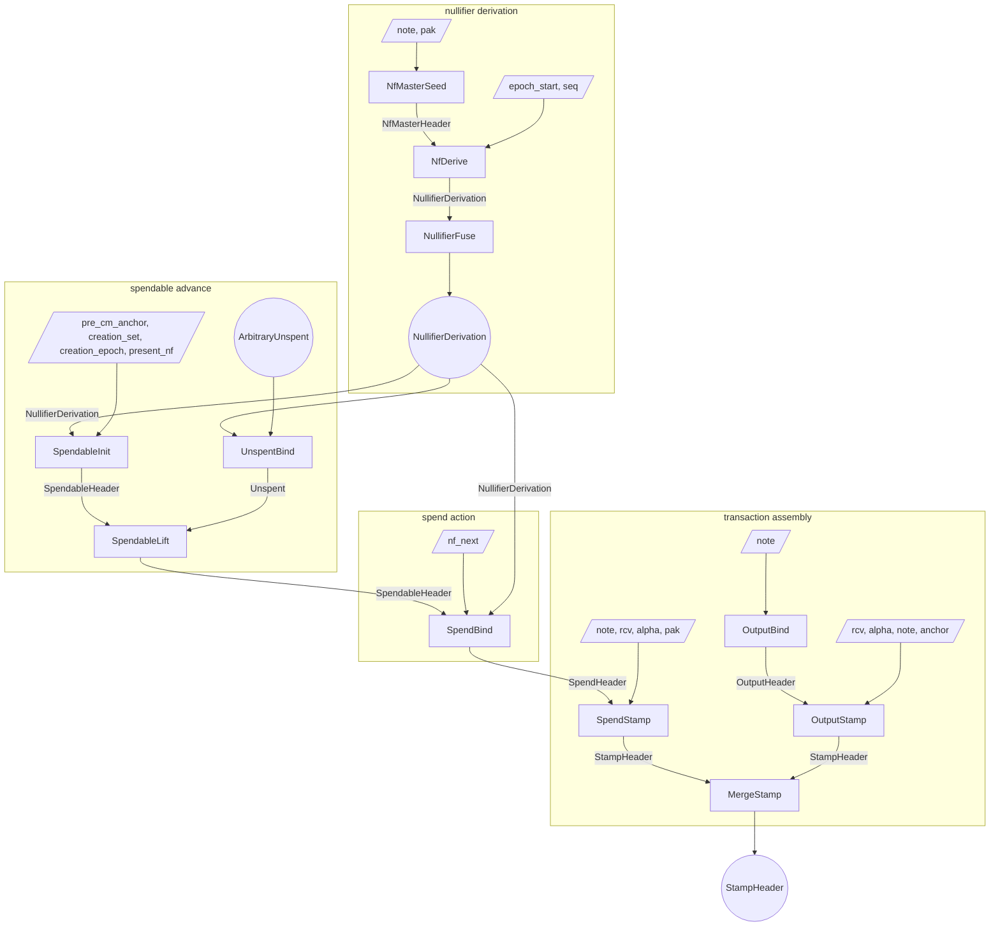
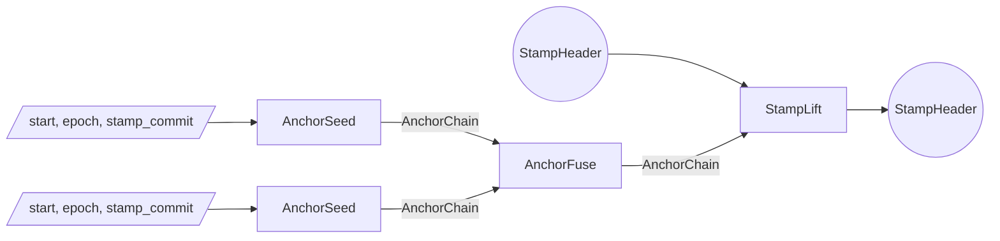
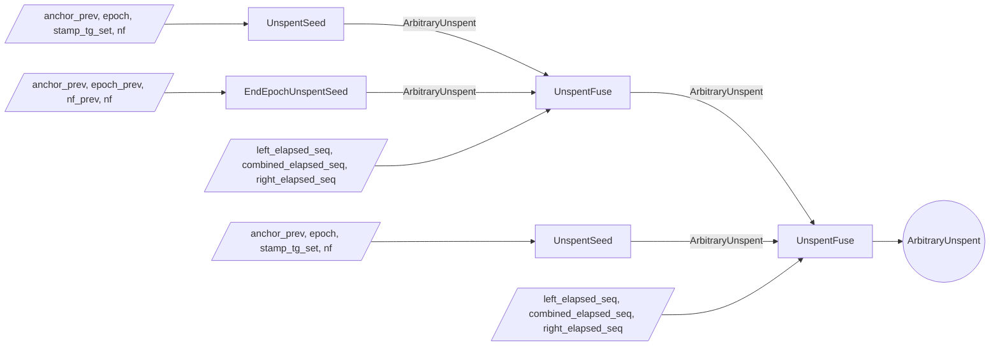

# Proof tree

The Tachyon proof tree is a graph of proof steps.
Each step accepts arbitrary witness inputs and up to two PCD inputs, performs computations and checks constraints, and emits a new PCD.

Multiple parties execute the proof tree.

- A **wallet** holds note data and keys
- A **sync service** holds nullifier values shared by the wallet and pool state proofs
- An **aggregator** merges stamps for pool efficiency

## Lifecycle

### Deriving nullifiers

A wallet proves a window of its note's nullifiers were correctly derived[^nullifiers].
`NfMasterSeed` witnesses the note and the proof-authorizing key `pak`, checks `note.pk == pak.derive_payment_key()` (which pins `nk`, and through `nk` the commitment `cm`), derives the master key `mk` and `cm`, and emits an `NfMasterHeader` carrying `(cm, mk)`. `nk` never leaves the step.
`NfDerive` consumes that seed. It witnesses the window's start epoch (constrained group-aligned) and its sequence, runs four sponges over $(\texttt{Tachyon-NfDerive}, \mathsf{mk}, w)$ to squeeze the window's 16 nullifiers natively, and binds the sequence to them with one opening at a free challenge (below). It exports the whole window, so the range it announces is derived rather than witnessed.
`NullifierFuse` concatenates two adjacent nullifier sequences into one, requiring the same `cm` and contiguity (`right.epoch_start == left.epoch_end`).
The result is a `NullifierDerivation` proving the range `[epoch_start, epoch_end)` commits to the genuine nullifiers of the note identified by `cm`, one factor per covered epoch.

### Bootstrapping a spendable

A spendable starts when `SpendableInit` consumes a `NullifierDerivation` covering the creation epoch.
It witnesses `(pre_cm_anchor, creation_set, creation_epoch, present_nf)` along with the derivation's sequence and a complement: dividing the creation epoch's factor out of the sequence forces `present_nf` to the range's genuine member there. It takes `cm` from the range header, checks `cm` is among the creation stamp's tachygrams[^tachygrams], and emits a `SpendableHeader` carrying `(cm, (creation_epoch, present_nf), anchor)` with `anchor = pre_cm_anchor.next_stamp(creation_epoch, creation_commit)`, the position immediately after the creation stamp, advanced by each lift.
`pre_cm_anchor` is a free witness, so the anchor binds only downstream: lift adjacency threads it to the eventual spend anchor, which consensus checks for chain membership, and a chain node's preimage fixes the real predecessor, the real creation epoch, and the real cm-stamp.

### Maintaining a spendable

Maintaining the spendable means advancing its anchor forward over `ArbitraryUnspent` segments while proving the crossed nullifiers absent.
The sync service produces `ArbitraryUnspent` segments without ever holding the note, its `cm`, or `psi`: the values a segment tests are arbitrary field elements as far as its own proof is concerned, and only `UnspentBind` attributes them to a derivation.
`UnspentSeed` absorbs one stamp at a given absolute epoch and proves a wallet-supplied nullifier was absent from that stamp's tachygram set; the resulting `ArbitraryUnspent` crosses no epoch boundary, so `epoch_start == epoch_last` and the tested nullifier is its single `elapsed` member.
A block that publishes no stamp advances no anchor, so a stampless span needs no segment and no proof work.
`UnspentFuse` composes two contiguous ranges that share a junction epoch (`right.epoch_start == left.epoch_last`): it concatenates their `elapsed` histories, keeping the junction member once, at adjacent anchors.
`EndEpochUnspentSeed` is the segment for the boundary itself: it folds the epoch tick from a witnessed epoch-terminal anchor, its two `elapsed` members being the epochs it leaves and enters, so `epoch_last == epoch_start + 1`.
A boundary is therefore a link like any other, and `UnspentFuse` composes it with its neighbours on both sides; an epoch that published nothing is simply two crossings with no stamp segment between them.

A `Summary` folds a run of one epoch's stamps into one accumulator alongside the anchor (`SummarySeed`, `SummaryAdvance`); summaries are note-independent, so anyone can build them.
`SummaryUnspentInit` starts an `ArbitraryUnspent` from one with a single exclusion query, and `SummarySpendableInit` starts a wallet's spendable from one covering its note's creation.

Summaries are also the roots of an epoch's QR evidence.
Once per epoch a builder routes every published tachygram into buckets by quadratic-residue profile (`QrSummaryIntakeInit`, `QrStampIntakeSeed`, `QrIntakeSplit`, `QrSideDescend`, `QrIntakeMerge`, `QrBucketSeal`) and records each profile's path as a pair of filter polynomials (`QrFilterSeed`, `QrFilterDescend`).
A nullifier has one profile, so it can have been published in only one bucket, and clearing it against that bucket clears the epoch (`QrResidueAttest`, `QrUnspentInit`).
`QrSpendableInit` starts a wallet's spendable from the bucket holding its note's creation, over the note's own QR segment for that epoch.
The evidence is note-independent and rebuildable from public data.

`UnspentBind` is wallet-side. It consumes the sync-built `ArbitraryUnspent` and a `NullifierDerivation`, and divides `elapsed` out of the derivation's sequence, so every factor of `elapsed` is a genuine nullifier of the note at its own epoch.
It emits an `Unspent` carrying the span's boundary nullifiers, anchors and epochs, and the note's `cm`.

`SpendableLift` is wallet-side and witness-free: it consumes a `SpendableHeader` and an `Unspent`.
It checks the verified segment's `cm` equals the spendable's (so the absence-proven nullifiers are this note's, and the value cannot drift), the segment's `nf_start` equals the spendable's `present_nf` (continuity), and the segment's `anchor_prev` equals the spendable's anchor (adjacency).
It advances to the segment's `nf_last` and `anchor_last`, threading `cm` unchanged.
A single lift can consume an arbitrarily long composed `ArbitraryUnspent`, including one that crosses many epoch boundaries.
A lineage resting on its epoch's terminal anchor lifts the same way: the boundary tick is a link, so a segment can open on it.

### Spending

To spend, the wallet runs `SpendBind`.
It consumes the `SpendableHeader` and a `NullifierDerivation` covering the current and next epochs, and witnesses the next-epoch nullifier `nf_next`.
It requires `range.cm == spendable.cm`, then confirms the published pair by dividing two adjacent factors out of the derivation's sequence, one indexed at the lineage's epoch and one at the next.
Because `present_nf` is threaded from the lineage, its factor is fixed before the challenge, and `nf_next` is forced to the genuine nullifier of the epoch after it.
Nonzero guards close the `nf == 0` degenerate.
The output `SpendHeader` carries `cm`, the confirmed pair `(present_nf, nf_next)`, and the threaded anchor; it carries no curve points.

`SpendStamp` consumes that `SpendHeader` and witnesses the note and the action fields.
It requires `note.commitment() == cm`, so the witnessed note is the spendable lineage's note: the value commitment `cv` then commits to the minted value[^notes].
It derives the action digest from `cv` and the randomized action key `rk`, and emits a `StampHeader` whose tachygram set contains both nullifiers and whose anchor is threaded from the spend.

An output operation splits the same way, into `OutputBind` and `OutputStamp`.
`OutputBind` witnesses the new note and derives its tachygram pair, the note commitment `cm` and the padding tachygram `pad`, both from the same note fields[^tachygrams]; the resulting `OutputHeader` carries the pair and nothing else.
`OutputStamp` re-witnesses the note against `cm`, adds value-randomness, action-randomness, and an anchor, and emits a single-action `StampHeader` whose tachygram set is the pair. The wallet typically anchors each output at the same height as the transaction's spends so the merge can proceed without an intervening lift.

A transaction with multiple spend and output stamps composes them with `MergeStamp`.
The output is a single `StampHeader` whose multisets are the union of the two inputs' at the shared anchor.

After the transaction stamp is fully composed, the wallet may run `StampLift` over an `AnchorChain` segment to advance the stamp's anchor toward the present tip before publication.

On publication the bundle carries the action descriptors, tachygrams, anchor, and the stamp proof.
Validators reconstruct the action-set and tachygram-set commitments from those published bundles, check the proof against the reconstructed values, and confirm the anchor against the consensus chain.

After publication, an aggregator combines `StampHeader`s from independently-proven bundles into a single **aggregate**[^aggregation] whose proof can stand in for many transactions' worth of stamps, cutting per-transaction verification cost downstream.
Each input is anchored at whatever height its wallet chose, so the aggregator obtains an `AnchorChain` segment per input and runs `StampLift` to bring every input onto a common later anchor.
`MergeStamp` then fuses the aligned stamps pairwise into a single `StampHeader` whose multisets are the union of all the inputs'.
The aggregated stamp has the same shape as any other, so it is itself eligible for further aggregation; aggregators stack to fold many published transactions into one stamp, and miners typically integrate the aggregator role into block production.

## Roles

The wallet runs every step that touches the note's commitment or master key.
It derives its nullifier windows (`NfMasterSeed`, `NfDerive`, `NullifierFuse`), derives spendable status from its own derivation (`SpendableInit`, `SummarySpendableInit`, `QrSpendableInit`), binds and lifts over sync-built segments (`UnspentBind`, `SpendableLift`), and produces spend and output stamps (`SpendBind`, `SpendStamp`, `OutputBind`, `OutputStamp`).

The sync service holds the per-epoch nullifier values the wallet shared and pool history.
It builds summaries (`SummarySeed`, `SummaryAdvance`), routes each epoch's tachygrams into QR evidence (`QrSummaryIntakeInit`, `QrStampIntakeSeed`, `QrIntakeSplit`, `QrSideDescend`, `QrIntakeMerge`, `QrBucketSeal`, `QrFilterSeed`, `QrFilterDescend`), and produces the `ArbitraryUnspent` segments that carry the spendable forward (`QrResidueAttest` and `QrUnspentInit` over one bucket; `SummaryUnspentInit` over a summary; `UnspentSeed`, `EndEpochUnspentSeed`, `UnspentFuse` per stamp), then hands the composed segment to the wallet to bind and lift over; it never sees a note, `cm`, `psi`, or `mk`.

The aggregator works only with published `StampHeader`s.
It aligns anchors with `StampLift` over `AnchorChain` segments (`AnchorSeed`, `AnchorFuse`) and fuses with `MergeStamp`.

| step | wallet | sync service | aggregator |
| ---- | ------ | ------------ | ---------- |
| AnchorSeed | possible | yes | yes |
| AnchorFuse | possible | yes | yes |
| SummarySeed | possible | yes | no |
| SummaryAdvance | possible | yes | no |
| SummaryUnspentInit | possible | yes | no |
| QrSummaryIntakeInit | possible | yes | no |
| QrStampIntakeSeed | possible | yes | no |
| QrIntakeMerge | possible | yes | no |
| QrIntakeSplit | possible | yes | no |
| QrBucketSeal | possible | yes | no |
| QrSideDescend | possible | yes | no |
| QrFilterSeed | possible | yes | no |
| QrFilterDescend | possible | yes | no |
| QrResidueAttest | possible | yes | no |
| QrUnspentInit | possible | yes | no |
| UnspentSeed | possible | yes | no |
| EndEpochUnspentSeed | possible | yes | no |
| UnspentFuse | possible | yes | no |
| NfMasterSeed | yes | no | no |
| NfDerive | yes | no | no |
| NullifierFuse | yes | no | no |
| UnspentBind | yes | no | no |
| SpendableInit | yes | no | no |
| SummarySpendableInit | yes | no | no |
| QrSpendableInit | yes | no | no |
| SpendableLift | yes | no | no |
| SpendBind | yes | no | no |
| OutputBind | yes | no | no |
| OutputStamp | yes | no | no |
| SpendStamp | yes | no | no |
| MergeStamp | yes | no | yes |
| StampLift | yes | possible | yes |

## Soundness

The subsections below walk each subtree bottom-up.

### Anchor segments

`AnchorSeed`, `SummarySeed`, `QrStampIntakeSeed`, `UnspentSeed`, and `EndEpochUnspentSeed` each witness a predecessor anchor and prove one anchor step from it, and the fuses compose adjacent segments by checking endpoint equality.
A segment ties to real chain history only through a consensus-published stamp whose anchor matches an end-of-block value, emitted at `StampLift`. `SpendableInit`'s anchor closes the same way without a segment: the private spendable's anchor reaches consensus once it is spent into a stamp.

### ArbitraryUnspent composition

An `ArbitraryUnspent` is a contiguous range bracketed by `anchor_prev` and `anchor_last`, with boundary pairs `(epoch_start, nf_start)` and `(epoch_last, nf_last)`, plus `elapsed`: the product of one indexed cubic factor per epoch covered over `[epoch_start, epoch_last]`[^nullifiers].
Each factor carries its own epoch, so the product is a multiset of `(epoch, nullifier)` pairs and needs no degree pin. Every producer holds three properties that `UnspentBind` relies on: each factor's epoch lies inside the span, each epoch has exactly one factor, and the boundary caches name factors the product holds.
`UnspentSeed` produces a within-epoch `ArbitraryUnspent` for one stamp's worth of anchor advance: `epoch_start == epoch_last`, and the nullifier it just non-membership-checked is the single factor, hence both `nf_start` and `nf_last`.
`EndEpochUnspentSeed` produces the other base case, the epoch boundary itself. It folds a witnessed epoch-terminal anchor through the cross-epoch domain and emits the tick's output as `anchor_last`, with `epoch_last == epoch_start + 1` and two factors, the epoch being left and the epoch entered. There is no exclusion to prove; that the witnessed predecessor really is its epoch's terminal anchor rests on consensus anchor membership of the eventual spend, since the tick of a short anchor is not a value consensus recomputes.
Each seed pins its own product against the pair it emits. The challenge absorbs the sequence commitment and a scalar-binding point of the free nullifiers, so a witnessed sequence cannot disagree with the header scalars.
`UnspentFuse` composes two contiguous ranges sharing a junction epoch (`right.epoch_start == left.epoch_last`) at adjacent anchors (`left.anchor_last == right.anchor_prev`), confirming

$$C(X) \cdot F_{\text{junction}}(X) = L(X) \cdot R(X)$$

for the witnessed `combined` $C$, left $L$, and right $R$. Both halves hold the junction epoch's factor, and dividing it out leaves each epoch represented once. The recursive verification of the two input PCDs binds $L$ and $R$ before the challenge.
The junction agreement (`left.nf_last == right.nf_start`) is well-formedness only, since a consistent pair of lies yields a wrong `elapsed` that `UnspentBind` rejects.

### Summaries

A `Summary` carries `(epoch, anchor_prev, anchor_last, acc_commit)`: a run of one epoch's stamps whose tachygram sets fold into one accumulator while the anchor absorbs the same commitments.
`SummarySeed` is `AnchorSeed` with the stamp's set commitment carried on the header.
`SummaryAdvance` binds the witnessed accumulator to the header by commit-equality, checks `extended = acc * stamp` at a challenge, and advances `anchor_last` by the same `stamp.commit()`.
The product of two root polynomials is the root polynomial of the multiset union, and consensus forbids republishing a tachygram within two epochs, so the accumulator is square-free.
Where a summary starts and stops is prover-chosen: a consumer splices summaries by anchor equality and passes through every stamp link regardless.

`SummaryUnspentInit` starts an `ArbitraryUnspent` from a summary with one exclusion opening on the accumulator; the summary's bracket becomes the segment's anchors, and its one-member `elapsed` is pinned as at `UnspentSeed`.
`SummarySpendableInit` starts a spendable from a summary covering the note's creation: `cm` opens to zero on the accumulator, `present_nf` opens nonzero, the read at the creation epoch is `SpendableInit`'s, and the spendable emits at the summary's terminal anchor.

Summaries root unbound like every seed. A consuming lineage closes at its own spend, where consensus anchor membership forces every spliced link.

### QR epoch evidence

An epoch's evidence partitions its tachygrams by a sequence of quadratic tests.
The discriminants iterate from the epoch's end-of-epoch anchor,

$$R_1 = H(\mathsf{terminal}), \qquad R_{j+1} = H(R_j),$$

so every discriminant postdates every tachygram in the epoch.
A value takes the residue side at depth $j$ when $x + R_j$ is a square or zero.
A profile is the string of sides on the path to a bucket.

`QrSummaryIntakeInit` starts a `QrIntake` from a `Summary` at depth zero, `QrStampIntakeSeed` starts one from a single stamp too large to summarize, and `QrIntakeMerge` joins two same-profile intakes whose spans meet, so spans compose as anchor segments do.
`QrIntakeSplit` factors an intake's contents into two sides as `QrIntakeSides`, and `QrSideDescend` extracts one side while attesting the other at its class multiplier $c$:

$$g(X)^2 - c\,(X + R) = s(X)\, h(X)$$

holds only when every root of the sibling $s$ takes its side at $R$, since each root leaves $g(x)^2 = c\,(x + R)$; with the split's product, every member of the extracted class is then in the child.
A child may carry a stray member of the other class, which only tightens the openings its consumers make, but it cannot lack a member of its own.
The exceptional value $-R$ has root $0$ under either class, so the split also opens the non-residue side nonzero at $-R$.
Each descend requires the parent's depth below 64, the width of the profile's side register, so $\mathsf{bits} < 2^{64} < p$ and two paths never share a profile.
A layer splits every intake, then merges same-profile neighbours while the product fits one polynomial.

`QrBucketSeal` turns a fully routed intake into a `QrBucket`, requiring

$$\mathsf{start} = H_\mathsf{ep}(\mathsf{prev\_last}, \mathsf{epoch}), \qquad \mathsf{end} = \mathsf{terminal},$$

and closing the bucket at the next epoch's opening anchor $H_\mathsf{ep}(\mathsf{terminal}, \mathsf{epoch} + 1)$, folded natively.
Only an epoch transition produces an anchor in the epoch domain, so `start` is an epoch's opening anchor and a partially routed intake cannot seal.
Epoch zero's opening anchor is this rule at $\mathsf{prev\_last} = 0$.
`terminal` is free at every root; one short of the epoch's last anchor folds to an anchor off the chain, which no honest segment continues, so the consuming lineage never reaches consensus.
`QrBucketSeal` is the only step that produces a `QrBucket`, and `QrUnspentInit` consumes nothing else.

`QrFilter` records a profile's path as the discriminants it classified on, sorted by side, one lineage per profile.
`QrFilterSeed` opens the empty pair and `QrFilterDescend` extends the selected side by $(Y - R)$, the multiplier being public in circuit.

The consumer reads the same identity the other way, with the path's discriminants as the roots and the nullifier as the shift.
`QrResidueAttest` proves

$$g(y)^2 - (\mathsf{nf} + y) = P_\mathsf{res}(y)\, h_\mathsf{res}(y)$$

at one challenge, which settles $g(R_j)^2 = \mathsf{nf} + R_j$ at every root $R_j$ of $P_\mathsf{res}$, at any depth, and binds the two-member `elapsed` of $(e, \mathsf{nf})$ and $(e + 1, \mathsf{nf\_next})$.
`QrUnspentInit` proves the non-residue half the same way, opens $P_\mathsf{non}$ nonzero at $-\mathsf{nf}$ so the exceptional discriminant stays residue-side, and opens the bucket at $\mathsf{nf}$.
The nullifier's class is then fixed at every level of the bucket's path, so no other bucket of the epoch can hold it.
The consumer checks that claim and bucket agree on epoch, terminal, profile and discriminant, and emits the bucket's span as a crossing segment, so consecutive epochs' segments fuse at the junction epoch with no boundary link between them; `start` closes through the lineage that consumes the emitted segment.

`QrSpendableInit` bootstraps a spendable from the bucket holding the note's creation.
Its left input is the note's `Unspent` over that epoch, the QR segment bound by `UnspentBind`, so `cm` and the whole-epoch absence of the nullifier arrive on the header; the step opens the bucket at $\mathsf{cm}$ for zero, requires the segment's span to equal the bucket's, and emits the spendable at the segment's tip.
Membership needs no profile: every bucket divides the epoch's stamp polynomials, so a root of any bucket is a tachygram published in its span, and the span equality closes the bucket's anchors through the lineage the segment already joins.

### Derivation window

`NfMasterSeed` is the only seed. It binds the master key to the note: `note.pk == pak.derive_payment_key()` pins `nk`, and the note commitment digests `nk` (through `pk`) and `psi`, so the derived `mk = Poseidon(psi, nk)` is consistent with the `cm` the seed threads forward.
`NfDerive` threads `mk` from that header, squeezes the window's nullifiers natively, and binds the witnessed sequence to them at a fresh challenge $z$:

$$g(z) = \prod_{j < K} F_{\texttt{base}+j,\ \mathsf{nf}_{\texttt{base}+j}}(z)$$

for $K$ the window width. The sequence is committed before $z$ exists, and every factor's scalars are pinned in-circuit: each epoch index is `epoch_start` plus a constant, and each nullifier is a sponge output of the threaded `mk`. `epoch_start` is a free witness constrained group-aligned in-step, pinned by the header it produces because it is emitted on the header directly.
`NullifierFuse` binds both sequences and their product by commit-equality and confirms $M(X) = L(X) \cdot R(X)$, requiring the same `cm` and contiguity, which keeps the product squarefree.

### Binding unspent to derivation

`UnspentBind` consumes the sync's `ArbitraryUnspent` and any `NullifierDerivation`, comparing no bounds against the unspent span.
It binds `elapsed` and the derivation's sequence $g$ to their headers by commit-equality, then confirms the divisibility

$$g(X) = \texttt{elapsed}(X) \cdot \texttt{complement}(X)$$

where the witnessed complement holds the derivation's factors outside the lineage. Every factor is irreducible, so divisibility is multiset containment: each `elapsed` factor, its epoch included, is a genuine derived pair, and an epoch the derivation lacks has no factor to divide out.
With the provenance properties above, every epoch of the span was therefore tested with its own genuine nullifier. The boundary caches inherit their genuineness from the same identity, so they need no separate check.
The derivation's `cm` is stamped onto the `Unspent`.

### Spendable lineage

`SpendableInit` is the lineage's only seed and is wallet-only.
It witnesses the creation stamp's tachygrams, the anchor running into the creation stamp, the creation epoch, and the starting-epoch nullifier `present_nf`.
It takes `cm` from the range header and binds the note to the pool (`cm` in `creation_set`), which pins the whole note to the real minted note.
It emits `SpendableHeader(cm, (creation_epoch, present_nf), anchor)`, where `anchor` folds the creation epoch onto the free-witnessed `pre_cm_anchor`; a wrong epoch or predecessor lands the anchor off the published sequence, so consensus anchor membership of the eventual spend forces both.
`present_nf` is forced to the range's member at the creation epoch by dividing its factor out of the derivation's sequence, the challenge absorbing a scalar-binding point of the free nullifier; each lift then requires an `Unspent`'s `nf_start` to equal it, keeping the lineage on the note's derived nullifiers.
`creation_epoch` needs no bound check, since divisibility forces its factor to be one the derivation actually holds.

`SpendableLift` advances the lineage over an `Unspent`.
It threads `cm` by equality (`unspent.cm == spendable.cm`), so every consumed segment belongs to the lineage's one note and the spent value cannot drift to a different same-`mk` note.
Every `Unspent` factor is genuine by `UnspentBind`, so a lineage cannot skip an epoch or splice in another note.

Continuity holds through the boundary pair: `unspent.nf_start == spendable.present_nf` and `unspent.epoch_start == spendable.epoch`.
Both nullifiers are PRF outputs of the note's sponge, so value-equality alone forces the same note and epoch. Carrying the epoch makes that a checked equality per lift, and lets the lineage state its position without a derivation in hand.
The anchor adjacency check (`unspent.anchor_prev == spendable.anchor`) welds the segment to the lineage's current position.

A lineage resting on its epoch's terminal anchor is not a special position: the segment it lifts over opens with the boundary tick, so adjacency holds against the anchor it already sits on.

That the anchor a crossing folds from really is its epoch's terminal anchor is not checked and cannot be, being a negative claim about what was published.
Ticking a mid-epoch anchor lands off the published sequence, which no later link rejoins, so consensus anchor membership of the eventual spend rejects it.
No coverage is skipped: the crossing leaves the epoch at its terminal anchor, and `present_nf`'s absence up to that anchor was proven by whatever placed the lineage there.

### Spend binding

Spending a note publishes two nullifiers, one for the current epoch and one for the next, both pinned to the note's genuine derivation.
`SpendBind` consumes the `SpendableHeader` and a `NullifierDerivation` covering the current and next epochs, witnesses `nf_next`, and requires `range.cm == spendable.cm`.
Dividing two adjacent factors out of the derivation's sequence confirms the pair. `present_nf`'s factor is native from left-header scalars, fixed before the challenge; the free `nf_next` is pinned by its scalar-binding point, absorbed into the challenge. Adjacency is the factor indices $e$ and $e+1$.
Each published nullifier must be nonzero, or it would collide with the note's own `cm` in the tachygram scan.
No note witness is needed here: the range and the lineage are already tied to the same note by their two `cm` fields, bound where the range was derived and at `SpendableInit` respectively.
The output `SpendHeader` threads `cm`, the confirmed pair, and the anchor, and carries no curve points.

`SpendStamp` completes the publication: it re-witnesses the note against the header's `cm`, derives the value commitment `cv` and the randomized action key `rk`, and commits the one-action set alongside the two-element tachygram set.
Requiring `note.commitment() == cm` rejects a phantom note reusing the same `psi`, and so the same nullifiers, while carrying a different value and hence a different `cm`.
The note is witnessed only in this terminal step, so it never propagates.

The two complementary `cm` checks pin value two independent ways. `cm == note.commitment()` ties `cm` to the note by `Poseidon` collision-resistance (the spender must know `rcm`, `pk`, `value`, `psi`). `spendable.cm == cm` ties it to the lineage, which the creation stamp proved minted. Together they bind the action's value commitment to the note actually being spent. Publishing both nullifiers lets consensus apply the spend across an epoch transition that may occur between proof construction and inclusion.

The note's age never becomes public. The lineage carries only a single current nullifier, not a polynomial with a consumed offset, and the published pair sits at the constant epochs of the live range, so no step reads a position that would leak how long the note has existed.

### Stamp construction

A stamp commits to two multisets, an action-digest set and a tachygram set[^tachygrams].
`OutputBind` derives the output's tachygram pair from one note, the commitment `cm` and the padding tachygram `pad`, so both are fixed before any action material exists. Each is nonzero-guarded, and the pad's preimage is the note opening rather than `cm`, which is what stops an observer pairing the two off in the published set[^tachygrams].
`OutputStamp` then derives a value commitment, action verification key, and action digest from a re-witnessed note, value-randomness, and action-randomness; constraints tie the note to the header's `cm` and reject over-range note values. No key material is witnessed: an output's `rk` is a fresh randomizer's public key, and the recipient's payment key rides inside `cm` where the sender cannot be asked to prove anything about it[^keys].
`SpendStamp` mirrors it on the spend side: it re-witnesses the note against the `SpendHeader`'s `cm`, derives the value commitment, action verification key, and action digest, and emits a stamp whose one-action digest set, two-nullifier tachygram set, and threaded anchor follow. The nullifier pair it publishes was already confirmed against the covering range at `SpendBind`.
`MergeStamp` fuses two stamps by checking anchor equality and confirming each output set is the union of the two inputs': it witnesses the merged sets and enforces, for each, that the merged set polynomial is the product of the input set polynomials.

### Stamp anchor

`OutputStamp` is the only stamp-producing step that takes an anchor as direct witness: an output operation has no prior chain state to thread from.
The other stamp-producing steps thread the anchor from a validated spendable through `SpendBind`/`SpendStamp`, equality-constrain the two inputs' anchors (`MergeStamp`), or advance over an `AnchorChain` segment whose start matches the stamp's prior anchor (`StampLift`).
Consensus verifies the published anchor against the chain before accepting the stamp.

### Rerandomization at trust boundaries

Every stamp-producing step rerandomizes its proof before releasing it: `prove_output`, `prove_spend`, and `prove_merge` each rerandomize the PCD they built. This is obligatory rather than cosmetic.

A PCD proof is a commitment to its own witness data. Two proofs built from overlapping private inputs are correlated as group elements, even when their public headers reveal nothing. The proof a wallet holds after `SpendBind` and the proof it publishes in a stamp share a lineage, so an observer holding both could link them, and an aggregator that merges two stamps sees both inputs directly.

A stamp crosses a trust boundary at exactly these points. A wallet hands an autonome to the p2p network; an aggregator hands a merged stamp onward while retaining the inputs it merged. Rerandomizing at each handoff replaces the proof with an unrelated one that verifies against the same header, so the released artifact carries no correlation back to the private lineage that produced it, and none forward to a later release of the same lineage.

The rule is that a proof leaving the process that built it is rerandomized first. Intermediate PCDs that stay inside a wallet, such as a derivation window or an `ArbitraryUnspent` segment, do not need it: nothing outside the wallet ever observes them.

## Simple transaction

A transaction with one spend and one output, where the spendable was bootstrapped in a previous epoch and lifted over an `ArbitraryUnspent` crossing an epoch boundary before the spend.

The single `SpendableLift` consumes one composed `Unspent` (potentially crossing many epoch boundaries); threading `cm` chains the lineage's binding to the note through every advance.

## Focused subgraphs

### Stamp anchor advance

### ArbitraryUnspent composition across epochs

## Headers

| Header | Fields |
| ------ | ------ |
| AnchorChain | (start, end) |
| Summary | (epoch, anchor_prev, anchor_last, acc_commit) |
| QrIntake | (epoch, terminal, start, end, profile, discriminant, contents) |
| QrIntakeSides | (epoch, terminal, start, end, profile, discriminant, residue, non_residue) |
| QrBucket | (epoch, terminal, start, end, profile, discriminant, contents) |
| QrFilter | (epoch, terminal, profile, next, residue_filter, non_residue_filter) |
| QrProfileClaim | (epoch, terminal, profile, next, nf, nf_next, non_residue_filter, elapsed) |
| ArbitraryUnspent | (anchor_prev, (epoch_start, nf_start), elapsed, (epoch_last, nf_last), anchor_last) |
| Unspent | (cm, anchor_prev, (epoch_start, nf_start), (epoch_last, nf_last), anchor_last) |
| NfMasterHeader | (cm, mk) |
| NullifierDerivation | (cm, epoch_start, nf_commit, epoch_end) |
| SpendableHeader | (cm, (epoch, present_nf), anchor) |
| OutputHeader | (cm, pad) |
| SpendHeader | (cm, present_nf, nf_next, anchor) |
| StampHeader | (action_commit, stamp_tg_commit, anchor) |

## Steps

| Step | Left | Right | Witness | Output |
| ---- | ---- | ----- | ------- | ------ |
| AnchorSeed | — | — | start, epoch, stamp_commit | AnchorChain |
| AnchorFuse | AnchorChain | AnchorChain | — | AnchorChain |
| SummarySeed | — | — | anchor_prev, epoch, stamp_commit | Summary |
| SummaryAdvance | Summary | — | acc, extended, stamp | Summary |
| SummaryUnspentInit | Summary | — | nf, summary_set, elapsed_seq | ArbitraryUnspent |
| SummarySpendableInit | NullifierDerivation | Summary | creation_epoch, present_nf, nf_seq, complement_seq, summary_set | SpendableHeader |
| QrSpendableInit | Unspent | QrBucket | contents | SpendableHeader |
| QrSummaryIntakeInit | Summary | — | terminal | QrIntake |
| QrStampIntakeSeed | — | — | anchor_prev, epoch, terminal, stamp_commit | QrIntake |
| QrIntakeMerge | QrIntake | QrIntake | left_contents, right_contents, merged | QrIntake |
| QrIntakeSplit | QrIntake | — | contents, residue, non_residue | QrIntakeSides |
| QrSideDescend | QrIntakeSides | — | bit, side_contents, interpolant, quotient | QrIntake |
| QrBucketSeal | QrIntake | — | prev_last | QrBucket |
| QrFilterSeed | — | — | epoch, terminal | QrFilter |
| QrFilterDescend | QrFilter | — | bit, side_filter, extended | QrFilter |
| QrResidueAttest | QrFilter | — | nf, nf_next, residue_filter, interpolant, quotient, elapsed_seq | QrProfileClaim |
| QrUnspentInit | QrProfileClaim | QrBucket | non_residue_filter, interpolant, quotient, contents | ArbitraryUnspent |
| UnspentSeed | — | — | anchor_prev, (epoch, nf), stamp_tg_set, elapsed_seq | ArbitraryUnspent |
| EndEpochUnspentSeed | — | — | anchor_prev, (epoch_prev, nf_prev), nf, elapsed_seq | ArbitraryUnspent |
| UnspentFuse | ArbitraryUnspent | ArbitraryUnspent | left_elapsed_seq, combined_elapsed_seq, right_elapsed_seq | ArbitraryUnspent |
| UnspentBind | ArbitraryUnspent | NullifierDerivation | elapsed_seq, nf_seq, complement_seq | Unspent |
| NfMasterSeed | — | — | note, pak | NfMasterHeader |
| NfDerive | NfMasterHeader | — | epoch_start, seq | NullifierDerivation |
| NullifierFuse | NullifierDerivation | NullifierDerivation | left_seq, merged_seq, right_seq | NullifierDerivation |
| SpendableInit | NullifierDerivation | — | pre_cm_anchor, creation_set, creation_epoch, present_nf, nf_seq, complement_seq | SpendableHeader |
| SpendableLift | SpendableHeader | Unspent | — | SpendableHeader |
| SpendBind | SpendableHeader | NullifierDerivation | nf_seq, complement_seq, nf_next | SpendHeader |
| OutputBind | — | — | note | OutputHeader |
| OutputStamp | OutputHeader | — | rcv, alpha, note, anchor | StampHeader |
| SpendStamp | SpendHeader | — | note, rcv, alpha, pak | StampHeader |
| MergeStamp | StampHeader | StampHeader | (action_set, tachygram_set) × left, merged, right | StampHeader |
| StampLift | StampHeader | AnchorChain | — | StampHeader |

[^nullifiers]: See [Nullifiers](./nullifiers.md) for the nullifier sponge, the scalar `psi` seed, and the delegated absence sequence.
[^tachygrams]: See [Tachygrams](./tachygrams.md) for the per-stamp multiset polynomial and its Pedersen commitment.
[^notes]: See [Notes](./notes.md) for the four-field note structure and its commitment.
[^keys]: See [Keys](./keys.md) for the wallet key hierarchy and the per-action derivations.
[^aggregation]: See [Aggregation](./aggregation.md) for the autonome/aggregate/adjunct lifecycle and the miner-side stripping that realizes the chain-cost reduction.
